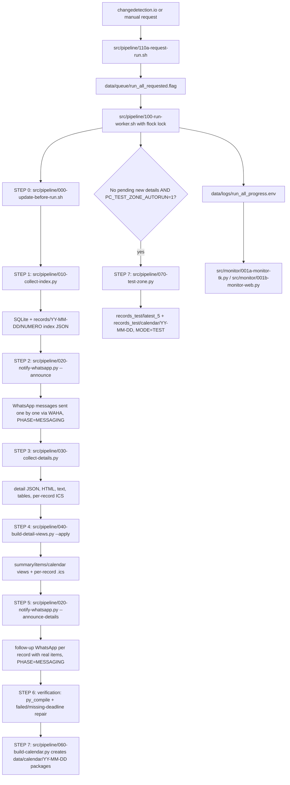

# PanamaCompra Collector

A local monitoring and archival system for **PanamaCompra** opportunities.

It watches the PanamaCompra *Cotizaciones en Línea* table, detects new or changed
opportunities, stores each one under its stable `NUMERO`, and optionally downloads
the full detail page into a local archive.

The project targets a **low-resource Linux workstation**: it never runs parallel
browser sessions and performs the index scan and detail download sequentially.

> **Linux only.** Every script, the systemd units, and the installer assume a
> Linux host (GNU coreutils, `bash`, `flock`, `systemd --user`, `xdg-open`, ...).
> It is not tested or supported on macOS or Windows (WSL2 running a real Linux
> userspace should work, but is untested).

## Quick start

```bash
git clone <this-repository-url> panamacompra-collector
# or: download and extract a ZIP of this repository instead of cloning
cd panamacompra-collector

./setup.sh                    # system packages (apt) + .venv + Python deps + Firefox + copies .env.example -> .env
./bin/pcc start 5              # small test run: index scan + up to 5 detail pages
./bin/pcc monitor               # open the native monitor (falls back to a background log follower if there is no display)
```

Everything the GUI monitors configure is also available headless through the CLI —
useful on servers/SSH sessions with no display:

```bash
./bin/pcc watch                                  # live terminal monitor
./bin/pcc db                                     # record + WhatsApp backlog counters
./bin/pcc set PC_WAHA_ENABLED 1                  # any monitor setting (same file the GUIs use)
./bin/pcc chat index 120363...@g.us              # WhatsApp destinations (default|index|details|status)
./bin/pcc keywords set "salud, medicamentos"     # keyword filter (blank = announce everything)
./bin/pcc test-whatsapp                          # one WAHA test message with the saved settings
./bin/pcc notify OC-2026-000123 --force          # manual WhatsApp send for specific record(s)
./bin/pcc docker up                              # manage the changedetection + WAHA containers
./bin/pcc templates select oferta.docx          # work templates copied into each record folder
./bin/pcc calendar week                          # opportunities by day/week/month/year (deadlines)
./bin/pcc format preview index                   # customize the WhatsApp message texts
./bin/pcc keywords index set "salud + panama, -construccion"   # per-destination filters (AND/OR/NOT)
./bin/pcc keywords index test "Compra de medicinas"            # dry-test a filter against sample text
```

A checkout **without** `.git` (for example a downloaded-and-extracted ZIP) installs
and runs the collector identically. The only features that need a real Git
remote are the optional self-update commands (`./update-local-copy.sh`, the
pre-run auto-update step, and the desktop **Update + Monitor** launcher) — the
worker treats a failed pre-run update as a warning and still collects with the
code already on disk, so a ZIP checkout is never blocked by it. See
[Installation](#installation) for the full walkthrough and
[Troubleshooting](#troubleshooting) if something does not start.

---

## Table of contents

1. [Quick start](#quick-start)
2. [What it does](#what-it-does)
3. [How it works](#how-it-works)
4. [Design decisions](#design-decisions)
5. [Installation](#installation)
6. [Usage](#usage)
7. [Scripts reference](#scripts-reference)
8. [Configuration](#configuration)
9. [Data and storage](#data-and-storage)
10. [changedetection.io and the webhook](#changedetectionio-and-the-webhook)
    - [Run the stack with Docker Compose](#run-the-stack-with-docker-compose)
11. [Monitoring and logs](#monitoring-and-logs)
12. [Troubleshooting](#troubleshooting)
13. [Security notes](#security-notes)
14. [Development](#development)

---

## What it does

The system collects and archives public opportunities from PanamaCompra. For each
opportunity it stores:

- `NUMERO` (the stable unique id), status group (`Programadas` / `Abiertas`), status
- Description, entity, dependency, table date, modality
- Detail URL, full detail HTML and visible text
- JSON metadata, plus one JSON file per table found in the detail page
- An estimated closing/finish date when one can be detected from the detail text

The unique identifier is always the PanamaCompra `NUMERO`, e.g. `2026-0-07-02-02-CL-058693`.
Visual row number and page number are intentionally **ignored** — they change whenever
new opportunities are inserted at the top of the table.

---

## How it works

```text
changedetection.io          detects a change in the PanamaCompra table (Docker)
        │
        ▼
src/webhook/010-webhook-listener.py         receives the webhook
        │                     • host/systemd mode → runs src/webhook/060-run-collector.sh directly
        │                     • docker enqueue mode (PC_WEBHOOK_ENQUEUE_ONLY=1) →
        │                       only writes data/queue/run_all_requested.flag, then
        │                       src/webhook/050-watch-queue-flag.sh (host) picks it up
        ▼
src/webhook/060-run-collector.sh            requests the full collector sequence
        │
        ▼
src/pipeline/110a-request-run.sh       creates data/queue/run_all_requested.flag
        │
        ▼
src/pipeline/100-run-worker.sh        single locked worker
        │
        ├─ STEP 0  src/pipeline/000-update-before-run.sh fast-forwards local checkout before each run
        ├─ STEP 1  src/pipeline/010-collect-index.py   scans Programadas + Abiertas + pagination
        ├─ STEP 2  src/pipeline/020-notify-whatsapp.py --announce  sends WhatsApp index alerts right after the index, BEFORE downloads (items shown as pending)
        ├─ STEP 3  src/pipeline/030-collect-details.py  downloads all pending detail pages, saves detail JSON/HTML/TXT, renames folders
        ├─ STEP 4  src/pipeline/040-build-detail-views.py --apply  refreshes summary/items/calendar sections + per-record .ics
        ├─ STEP 5  src/pipeline/020-notify-whatsapp.py --announce-details  sends the follow-up WhatsApp per record with the real downloaded items
        ├─ STEP 6  verification/repair      py_compile check + retry failed/missing-deadline records
        ├─ STEP 7  src/pipeline/060-build-calendar.py     writes timestamped .ics import packages for new events
        └─ STEP 8  src/pipeline/070-test-zone.py          OPTIONAL, off by default: set PC_TEST_ZONE_AUTORUN=1 to re-run the last 5 in a sandbox when no new records
        │
        ▼
records/YY-MM-DD/(finish)-(NUMERO)-(desc)/    NUMERO.json, NUMERO.detail.{json,html,txt}, NUMERO.calendar.ics, tables/*.json
records_test/…                                isolated testing sandbox (shown as MODE=TEST in the monitor)
data/calendar/YY-MM-DD/YY-MM-DD_HH-MM_panamacompra_calendar_001.ics  normal-run import packages
```

### Simple user flow graphic

```text
Example: changedetection sees a new PanamaCompra row OC-2026-000123

[1 Detect] changedetection.io notices the table changed
      │
      ▼
[2 Queue] src/webhook/010-webhook-listener.py accepts /panamacompra/<token> and queues one run
      │
      ▼
[3 Index] src/pipeline/010-collect-index.py records the index row in SQLite
      │
      ▼
[4 Compare + Notify] src/pipeline/020-notify-whatsapp.py compares against the last notified snapshot
      │
      ├─ No change ───────────────► no WhatsApp message
      │
      └─ New/status/items changed ─► one WhatsApp message for OC-2026-000123 sent
                                      IMMEDIATELY (items marked "pendiente" until downloaded)
      │
      ▼
[5 Download] src/pipeline/030-collect-details.py downloads ALL detail fields + items
      │
      ▼
[6 Notify details] one follow-up WhatsApp per record with the real items
      │                                     + data/calendar_exports/YYYY/MM/OC-2026-000123.ics
      ▼
[7 Summary] worker sends one final run summary after all steps finish
```

Key point: the webhook only starts/queues the run. Two notifier phases: the index
alert is sent right after the index step — before the long download phase — so
subscribers hear about a new opportunity immediately, and once its detail page is
downloaded a follow-up message delivers the full record (items, location, dates)
in the rich format. Disable the follow-up with **PC_NOTIFY_DETAILS=0** to fold the
items into the snapshot silently instead.

### Process diagram and test visibility



The monitor now shows separate `normal_run` and `test_run` flags, plus worker/index/detail/calendar flags. Webhook-triggered runs show `MODE=AUTO`; manual collector starts show `MODE=RESTART`; the isolated test zone shows `MODE=TEST`, so it is visible when the worker is exercising code paths without touching the real archive.

The workflow has two phases run back-to-back by the worker:

| Phase | Script | Work |
|-------|--------|------|
| **Pre-run update** | `src/pipeline/000-update-before-run.sh` | Before each worker iteration, auto-stash any local edits to tracked files, fast-forward the local Git checkout (reset to remote if diverged), refresh installed Python requirements when `.venv` exists, and fix executable bits. Untracked runtime files never block it. If the update fails (e.g. no network), the worker logs a warning and **still runs** the collection with the current code instead of skipping. Set `PC_RUN_UPDATE_BEFORE_RUN=0` to skip the update entirely. |
| **Index scan** | `src/pipeline/010-collect-index.py` | Open the table, select *Programadas*, set 50 rows/page, crawl all pages, repeat for *Abiertas*. Save lightweight index JSON + DB records. |
| **Detail download** | `src/pipeline/030-collect-details.py` | Read pending records from SQLite, visit each detail URL, save HTML / text / metadata / table JSON, mark as saved. |

> The current architecture is **run-all only**. The older queue-based system is
> deprecated and is not part of this repository.

---

## Development methodology

The repository includes lightweight Scrum/agile infrastructure so future work can be
managed as auditable backlog items instead of ad-hoc edits:

- GitHub issue templates capture defects, feature requests, priority and acceptance criteria.
- The pull request template requires validation evidence, linked backlog context and rollback notes.
- CI runs Python dependency installation, compile checks, installation validation and shell syntax checks.
- `docs/AGILE_PROCESS.md` defines sprint cadence, Definition of Ready, Definition of Done, branching and release expectations.

These controls are intentionally lightweight: they improve repeatability without
changing the collector's local-first operating model.

## Design decisions

- **`NUMERO` is the primary key.** Row number, page number, changedetection history
  position and visual order are all unstable and are never used as identifiers.
- **Index and detail are split.** Scanning the table is light; downloading detail
  pages is heavy. Splitting them keeps browser work small at any one moment.
- **One browser process at a time.** The worker takes a `flock` lock. If a new
  trigger arrives while it is running, a request flag is left behind and the worker
  runs one more full sequence after it finishes — no duplicate Firefox sessions.
  If the worker exits before a clean shutdown, it restores the request flag so the
  next `src/pipeline/110a-request-run.sh` start resumes pending database work instead of
  losing the interrupted task.
- **Immutable archive.** Existing JSON / HTML / text files are never overwritten;
  completed folders are skipped.

---

## Installation

The scripts resolve their own location, so the project can live in **any directory**
(`~/Apps/panamacompra-collector` is just the example used below).

### Requirements

- **Linux** (Debian / Ubuntu / Linux Mint recommended). Not tested on macOS or Windows.
- Python 3.10+ (the installer checks this before creating `.venv`; 3.12 is used in development)
- Playwright Firefox browser — installed automatically by `./setup.sh`, including Debian/Ubuntu browser libraries when apt is available; or manually in the active virtualenv with `python -m playwright install --with-deps firefox`
- Shell tools: `bash`, `flock`, `timeout`, `pgrep`, `pkill`, `tail`, `sed`, `grep`, `find`, `date`, `tee`, and a desktop opener such as `xdg-open` for opening the test sandbox folder after monitor-launched tests
- Optional: `sqlite3` CLI for manual inspection
- Optional: `git` — only required for the self-update commands (`./update-local-copy.sh`, the worker's pre-run auto-update step, the desktop **Update + Monitor** launcher). A checkout obtained by downloading and extracting a ZIP (no `.git` directory) installs and collects normally; a failed pre-run update is only logged as a warning and never blocks a run.


### Updating an existing local copy

On the workstation, update the existing checkout safely with:

```bash
cd ~/Apps/panamacompra-collector
./update-local-copy.sh
```

The update script always brings the checkout up to date. It stops active collector
workers, **auto-stashes** any local edits to *tracked* files (kept in the stash for
recovery, never lost), ignores untracked runtime files (`data/`, `records/`,
`.webhook_token`, `.venv.broken.*`, …), auto-selects the branch to track (the most
recent unmerged remote branch, otherwise `main`; pin one with `PC_UPDATE_BRANCH`),
fast-forwards it, refreshes
the Python virtual environment dependencies, fixes executable bits, and runs the
system review. If the webhook listener was running before the update, or if the
`panamacompra-webhook.service` user service is enabled, the updater restores it at
the end so changedetection.io does not keep seeing `Connection refused` after a
manual **Update + Monitor** launch. It also tries to restore the listener on failed
updates before exiting. It uses `git pull --ff-only`; if the local branch has diverged
and a fast-forward is impossible, it resets the branch to the remote (diverging
commits stay reachable via `git reflog`), so an unattended update never stops
half-way. To request a small smoke run after the update, use:

```bash
cd ~/Apps/panamacompra-collector
PC_UPDATE_TEST_DETAIL_LIMIT=5 ./update-local-copy.sh
```

#### Recovering from a blocked merge or PR checkout

If Git reports `Merging is not possible because you have unmerged files`, finish or
abandon the in-progress merge before trying another branch. The safest recovery path
on the workstation is:

```bash
cd ~/Apps/panamacompra-collector
git status --short --branch
git merge --abort
git fetch --all --prune
git checkout main
git pull --ff-only origin main
```

Then switch to the branch you want to test and update it from the refreshed `main`.
Run the merge only if the checkout command succeeds:

```bash
gh pr checkout 3
git merge main
# If conflicts are reported, edit the listed files, then:
git status --short
git add <resolved-files>
git commit
```

If `gh pr checkout 3` says the branch has diverged or cannot fast-forward, the PR
branch was likely force-pushed after your local checkout was created. If you do not
need to preserve local commits on that PR branch, reset the local branch to the
remote PR branch and try again:

```bash
git merge --abort 2>/dev/null || true
git checkout main
git branch -D codex/fix-progress-bar-bugs-in-monitor-hein5x
git fetch origin codex/fix-progress-bar-bugs-in-monitor-hein5x
git checkout -B codex/fix-progress-bar-bugs-in-monitor-hein5x \
  origin/codex/fix-progress-bar-bugs-in-monitor-hein5x
git merge main
```

After any failed checkout or merge, stop and re-run `git status --short --branch`
before continuing. Do not run the next merge command if the checkout command failed,
because it may merge into whichever branch is currently checked out.

A message such as `not something we can merge` usually means the branch name is not
available locally. Fetch it first, or merge the remote-tracking name directly, for
example `git fetch origin codex/review-project-for-enhancements-e8vmmy` followed by
`git merge origin/codex/review-project-for-enhancements-e8vmmy`.

### One-command setup

```bash
cd ~/Apps/panamacompra-collector
./setup.sh
```

`setup.sh` installs Debian/Ubuntu Python system packages when `apt-get` is
available, verifies that the selected `PYTHON_BIN` is Python 3.10+ with working
`venv`/`ensurepip` support, copies `.env.example` to `.env` on first run if
`.env` does not already exist, creates `.venv`, installs Python dependencies,
installs the Playwright Firefox browser (plus Linux browser dependencies on
Debian/Ubuntu/Linux Mint when apt is not skipped), creates runtime directories,
writes a full review log to `data/logs/setup_YYYYMMDD_HHMMSS.log` (or `PC_SETUP_LOG_FILE`) and finishes by running `./scripts/validate-installation.sh`. The validator
automatically uses `.venv/bin/python` when that virtual environment exists, so
standalone validation checks the same interpreter the collector will use. Set
`PC_SETUP_SKIP_APT=1` when system packages are managed separately,
`PC_SETUP_SKIP_BROWSER=1` for
CI/offline validation, or `PC_SETUP_SKIP_DOCKER=1` to skip the Docker step at
the end of setup. That step installs the Docker engine + compose plugin with
apt when missing (Debian/Ubuntu/Linux Mint), enables the service, adds your
user to the `docker` group (re-login to use it without sudo), and brings the
changedetection + WAHA + webhook stack up with `./src/tools/010-docker-stack.sh up`
(bootstrapping the first start with sudo when needed; container data lives in
`var/integrations`, override with `PC_INTEGRATIONS_DIR`) — these must be set as real environment variables
(`PC_SETUP_SKIP_APT=1 ./setup.sh`, not written into `.env`), since a real
environment variable always takes precedence over `.env`/`config/defaults.env`
values, matching this project's usual "environment variable > file > default"
precedence.

### Manual setup

```bash
cd ~/Apps/panamacompra-collector

# System packages: browser + complete Python venv support + optional Tk monitor
sudo apt update && sudo apt install -y python3-venv python3-full python3-tk ca-certificates curl

# Python environment
python3 -m venv .venv
source .venv/bin/activate
python -m pip install --upgrade pip
python -m pip install -r requirements.txt

# Browser engine used by the collectors
python -m playwright install --with-deps firefox

# Validate the checkout and create runtime directories. This compiles all Python
# sources, syntax-checks shell wrappers, verifies required executables, and
# confirms Playwright is importable from `.venv` unless --skip-browser is used.
./scripts/validate-installation.sh
```

`requirements.txt` intentionally lists only pip-installable Python modules. The
collector's non-stdlib runtime module is `playwright`; `tkinter` and the Python
stdlib extension `_posixsubprocess` come from the operating-system Python
packages above. If an existing `.venv` fails with `ModuleNotFoundError:
_posixsubprocess`, install `python3-venv` / `python3-full` and rerun
`./update-local-copy.sh`; the updater detects an incomplete `.venv`, moves it to
`.venv.broken.YYYYMMDD_HHMMSS`, and recreates a clean one.

Operational shell wrappers use the repository `.venv` when it exists and fall
back to `python3` when it does not. The status/stop/monitor scripts recognize
collector processes launched by either `python` or `python3`. The local updater
verifies that Playwright Firefox can launch and installs it automatically unless
`PC_UPDATE_SKIP_BROWSER_INSTALL=1` is set.

---

## Usage

All commands assume you are in the project directory.

```bash
# Run a small full sequence (index + 5 detail pages) and open the native monitor
./src/pipeline/110a-request-run.sh 5
./src/monitor/000-open-monitor.sh   # native Tk window; no Firefox/web browser

# Run the full sequence (index + all pending detail pages)
./src/pipeline/110a-request-run.sh

# Run the worker in the foreground (this terminal)
./src/pipeline/110b-run-now.sh 5

# Check status
./src/pipeline/130b-run-status.sh

# Follow the logs live
./src/pipeline/130c-follow-run.sh

# Emergency stop (use only if a browser step is frozen)
./src/pipeline/120a-stop-everything.sh
```

You can also run a single phase manually:

```bash
source .venv/bin/activate
./src/pipeline/010-collect-index.py                 # index scan only
PC_DETAIL_LIMIT=5 ./src/pipeline/030-collect-details.py   # download up to 5 pending details
```

---

## Scripts reference

| Script | Role |
|--------|------|
| `src/common.py` | Shared module: paths, DB schema, JSON helpers, URL/date detection. **Not run directly.** |
| `src/pipeline/010-collect-index.py` | Index scan. Crawls Programadas + Abiertas, writes index JSON and DB records. |
| `src/pipeline/030-collect-details.py` | Detail download. Saves HTML/text/metadata/tables for pending records. |
| `src/pipeline/110a-request-run.sh` | **Main entry point.** Requests a full run and starts the worker if idle. |
| `src/pipeline/100-run-worker.sh` | Locked sequential worker: pre-run update, **index → WhatsApp index alerts → details/downloads → storing/per-record calendars/detail views → WhatsApp item-detail follow-ups → verification → calendar packages**, optional test zone; repeats if re-requested. A failed pre-run update only logs a warning — the worker still collects with the current code. It records per-step durations in `data/logs/run_all_last_summary.env`, and live monitor ETA prefers the previous completion time when available. |
| `src/pipeline/000-update-before-run.sh` | Lightweight pre-run updater called by the worker before every iteration; auto-stashes local tracked edits, fast-forwards Git (reset to remote if diverged) and refreshes requirements without stopping the active worker. Untracked runtime files never block it. |
| `src/notify/010-waha-client.py` | Optional dependency-free WAHA notifier for short operational WhatsApp alerts (start/done/failed/…). Enabled only when WAHA environment variables are configured. |
| `src/pipeline/020-notify-whatsapp.py` | WhatsApp (WAHA) notifier helpers and entry point. Two notifier phases. The worker calls `--announce` in the first MESSAGING step **right after the index, before detail downloads**, sending one “🔔 Nueva Oportunidad” message per new record with per-message monitor progress (items shown as pending); after downloads + views it calls `--announce-details`, which sends the follow-up “📥 Detalles Completos” message per record with the real items and exports its calendar. `--idle` sends “⚪ Sin nuevas entradas”; `--flush` retries failed sends; `--sync-snapshots --since TS` is the silent fallback when `PC_NOTIFY_DETAILS=0`. Supports an optional keyword filter and a first-use baseline so the existing archive is never re-announced. |
| `src/pipeline/110b-run-now.sh` | Runs the worker in the foreground for interactive use. |
| `src/webhook/060-run-collector.sh` | Bridge called by the webhook listener; requests a full run. |
| `src/webhook/010-webhook-listener.py` | Local HTTP listener for changedetection.io notifications. Runs `src/webhook/060-run-collector.sh` directly, or (with `PC_WEBHOOK_ENQUEUE_ONLY=1`, as in the Docker stack) only writes the run request flag for the host runner. |
| `src/webhook/020-start-listener.sh` | Safe manual/autoupdate starter for the webhook listener; verifies `.webhook_token`, can replace an old process occupying the webhook port with `--replace-port-owner`, starts with `nohup` or `--foreground` for systemd, logs to `data/logs/webhook_listener.out.log`, and returns immediately to the monitor. |
| `src/webhook/030-install-service.sh` | Installs/repairs the persistent user `panamacompra-webhook.service` with the safe foreground starter, so stale port owners are replaced before binding. |
| `src/webhook/050-watch-queue-flag.sh` | Host runner for the dockerized webhook: watches `data/queue/run_all_requested.flag` and launches the host collector (`src/pipeline/110a-request-run.sh`) when a request is enqueued. Install as the `panamacompra-runner.service` user unit. |
| `docker-compose.yml` / `docker/Dockerfile.webhook` | Reproducible stack: changedetection.io + sockpuppetbrowser + WAHA + the enqueue-only webhook listener. |
| `src/webhook/040-diagnose-webhook.sh` | Diagnostic/fix helper for changedetection.io webhook reachability; starts the listener on `PC_WEBHOOK_HOST:PC_WEBHOOK_PORT`, tests local curl, and tests from the changedetection container when Docker is available. |
| `src/tools/040-message-formats.py` | Customizable WhatsApp message formats: the operator can rewrite the text of the **index alert**, the **detail follow-up**, and the **status-change** messages with `{placeholder}` templates (`pcc format show/preview/set/reset/placeholders`; unknown placeholders stay literal so a typo never breaks a send). Also editable from both monitors; stored in `data/config/waha_format_<kind>.txt`. Blank/absent = built-in layout. |
| `src/tools/030-opportunity-calendar.py` | Opportunity calendar: collected opportunities by **day / week / month / year**, driven by deadline (default), start, or local-download dates. Month view is a grid with per-day counts plus the day-by-day listing; year view shows per-month totals. Backs `pcc calendar` and the **Opportunity calendar** panels in both monitors (all three share this renderer). |
| `src/tools/020-record-templates.py` | Work templates: keep reusable files (bid forms, checklists, ...) in a source folder (`PC_TEMPLATES_SRC_DIR`, default `var/templates`), select one or more (`pcc templates select`), and they are copied into `templates/` inside every record's detail folder — automatically for records downloaded in each run, and on demand with `pcc templates apply`. Existing files are never overwritten unless `--overwrite`, so in-progress work is safe. Also manageable from both monitors (source folder, file selection, apply-to-all, copy-to-selected-records). |
| `src/tools/010-docker-stack.sh` | Manage the changedetection + sockpuppetbrowser + WAHA + webhook containers (`up`/`down`/`restart`/`status`/`logs`). Keeps container data in `$PC_INTEGRATIONS_DIR` (default `var/integrations`), migrates a legacy `./integrations` folder, and applies monitor-saved container settings on restart. Exposed as **Integrations** buttons in both monitors. |
| `src/tools/100-migrate-apps-layout.sh` | Dry-run/apply helper to consolidate older `/Apps/panamacompra-monitor`, `/Apps/panamacompra-webhook-receiver`, and `/Apps/waha` folders into `/Apps/panamacompra-collector/integrations/`, with optional compatibility symlinks. |
| `src/monitor/001a-monitor-tk.py` | Preferred lightweight native Tk monitor window with a vertical scrollbar; no Firefox/browser or web server required. It includes locked automatic/restart/manual/test run controls, **Records Pendings**, **Records Completed**, a detailed DB summary of the elements/columns composing the archive, Settings, record index, grouped manual actions, stop buttons and test-sandbox folder opening after test-zone completion. |
| `src/monitor/002-next-run-timer.py` | Small **fixed-size** always-on-top dashboard centered near the top of the desktop (about 30 px down) counting down to the next live run. The countdown is anchored to the **last live run's start time** (from `run_all_progress.env`) plus the interval, so it tracks the real cadence and rolls forward if a run is overdue (falling back to clock boundaries when no previous run is recorded), and turns amber in the final minute. It also shows the **current git branch**, the **queue state**, the **latest collected records** (newest NUMERO + end date/status + short description, read from `data/panamacompra_archive.db`), a **last-run summary** (New/Saved counts + total archive size + saved/pending/failed DB counts), and the previous completion time broken down into index, detail/download, storing/views, calendar and messaging durations. Withdraws while a live run is active and reappears when finished. Size/position and the number of records shown are configurable via `PC_NEXT_RUN_TIMER_WIDTH/HEIGHT/TOP` and `PC_NEXT_RUN_TIMER_RECORDS`. |
| `src/monitor/001b-monitor-web.py` | Optional local browser monitor at `http://127.0.0.1:8766/`; loads once, polls lightweight JSON, offers the same locked automatic/restart/manual/test controls, **Records Pendings**, **Records Completed**, detailed DB summary, grouped action buttons, and auto-closes only after completed collector runs. |
| `src/monitor/001c-monitor-terminal.sh` | Optional live terminal progress monitor; auto-closes when idle. |
| `src/monitor/000-open-monitor.sh` | Opens/starts the native Tk monitor and the tiny next-run timer by default. Set `PC_MONITOR_MODE=web` for browser monitor or `PC_MONITOR_MODE=terminal` for terminal monitor. |
| `src/pipeline/130b-run-status.sh` | One-shot status snapshot. |
| `bin/pcc` | Unified headless CLI: run control (`start`/`stop`/`status`/`watch`), archive + WhatsApp backlog counters (`db`), monitor settings (`get`/`set`), WhatsApp destinations (`chat default|index|details|status`), keyword filter (`keywords`), test message (`test-whatsapp`), manual record notifications (`notify`), Docker stack (`docker`), webhook, setup/uninstall/launcher. Writes the same `data/config` files as the GUI monitors, so CLI and monitors stay interchangeable. |
| `src/pipeline/130a-queue-status.sh` | Prints the collector request queue, the Update + Monitor queue, runner/worker process state, the current progress snapshot, and recent log tails. Backs `bin/pcc status`. |
| `data/logs/run_all_last_summary.env` | Last successful run duration summary used by monitor ETA and the next-run timer. |
| `src/pipeline/120a-stop-everything.sh` | Emergency stop for stuck index/detail/worker processes. |
| `src/pipeline/120b-stop-collectors.sh` | Stops only the active collection (worker/index/detail/test/calendar) and marks it as an intentional no-resume stop, but leaves the monitor, next-run timer, and webhook listener running. Used by the monitor's **Stop** button. |
| `src/pipeline/130c-follow-run.sh` | `tail -f` of the worker and current-run logs. |
| `src/tools/090b-migrate-previous-records.py` / `.sh` | Migrate old flat `records/NUMERO/` folders into dated archive folders; detail download then renames them to `<finish>--<numero>--<desc>`. |
| `src/tools/070-rename-record-folders.py` | Rename record folders to `<finish>--<numero>--<desc>` from already-saved data. Dry-run by default; `--apply` to act. |
| `src/tools/110-reset.py` | Reset/"review from zero" helpers shared by both monitors, one subcommand per action: `requeue-details`, `reset-notify`, `wipe-db`, `wipe-all`. The two destructive actions refuse to run without `--yes`. Used by the monitors' Reset panel. |
| `src/tools/060-import-selected-calendars.py` | Export/open `.ics` calendar files for one or more selected record NUMEROs; used by the monitors' **Import selected calendars** action. |
| `src/tools/120-setup-git-credentials.sh` | One-time helper that points this checkout's Git credential helper at `store` (instead of the desktop keyring) and optionally pre-seeds a GitHub token, so the desktop updater launcher never has to prompt for a password. |
| `src/tools/050-maintain-database.py` | Browser-free DB maintenance/backfill tool. Applies schema migrations, reviews existing `opportunities` rows, and backfills metadata about record folder leaf names, split detail/table counts and file layout version. Run manually with `--apply`; update scripts run it automatically after code refresh. |
| `src/pipeline/040-build-detail-views.py` | Backfill the `summary` / numbered `items` / `calendar` views into existing `detail.json` files from saved text/tables (browser-free), and writes split `detail_sections/*.json` files. Dry-run by default; `--apply` to act. The worker uses `--since "$PC_RUN_STARTED_AT"` so only detail files touched in the current run are refreshed before packaging. |
| `src/tools/080-update-day-folder.py` | Manually **re-download** every record in a `YY-MM-DD` day folder from the live portal (overwriting saved HTML/text/detail JSON/calendar ICS/tables) to refresh records pulled under an earlier portal version. Prompts for the day (default today) or takes `--date`; lists and asks before downloading, or `--apply` to skip the prompt. |
| `src/pipeline/050-repair-missing-deadlines.py` | Finds records/folders with no `DTEND`/deadline (blank `finish_date_guess` or `(NO-DATE)` folder), force re-downloads their details, recalculates the close window, and renames folders when a deadline is recovered. Dry-run by default; `--apply` to act. |
| `src/pipeline/060-build-calendar.py` | Build timestamped `.ics` import packages from new/changed detail calendars under `data/calendar/YY-MM-DD/`, defaulting to 10 events per file. Runs automatically as STEP 5 after per-record detail views and the verification/repair step; use `--all` to package every saved record, `--flat` for the old parent-only layout, or `--legacy-combined` to also write the old single combined file. |
| `src/pipeline/070-test-zone.py` | **Testing zone.** Re-run the last N records (default 5) through the full pipeline in an isolated sandbox (`records_test/latest_5/`, throwaway DB, test calendar packages under `records_test/calendar/YY-MM-DD/`), leaving the real archive untouched. It does **not** run automatically anymore; opt in with `PC_TEST_ZONE_AUTORUN=1` to have STEP 7 run it when a run finds no new records, or launch it from the monitor's manual actions. The monitor shows `MODE=TEST` and the `test_run` flag. |
| `review-system.sh` | Health check: required scripts, compile/syntax checks, process and status review. |
| `update-local-copy.sh` | In-place updater for an existing checkout that always brings it up to date: stop **only the collector pipeline + webhook trigger** (never the updater/loader/monitor themselves, which previously caused the update to freeze or close on itself), auto-stash local tracked edits (kept for recovery), **auto-select the branch** (track `main` when the most recently updated remote branch is already merged into `main`, otherwise switch to that latest branch), reset to the remote, refresh dependencies, run health checks, and install the Update + Monitor desktop shortcut. Runtime data (`data/`, `records/`, `.venv`) is protected by `.gitignore` so the reset/`git clean` can never delete the archive or database. |
| `src/monitor/003-update-loader.py` | Separate centered Tk updater loader window for desktop/manual updates. Appears first with a step-based progress bar, tails the update output, and opens the monitor only **after the update finishes successfully** so the monitor reflects the already-updated code; failed updates keep the loader open with the log path and do not open the monitor. Stopping a worker for update/manual stop does not recreate the pending/recover request flag, so an update launcher will not silently restart failed or pending work. |

---

## Configuration

Behavior is controlled with environment variables (all optional):

| Variable | Default | Used by | Meaning |
|----------|---------|---------|---------|
| `PC_INDEX_LIMIT` | `PC_MAX_PAGES_PER_GROUP` / `0` | worker/index collector | Optional index page cap per status group. `0`, `auto`, or `all` means no normal cap: crawl until PanamaCompra has no Next page. |
| `PC_MAX_PAGES_PER_GROUP` | `0` | index collector | Legacy alias for `PC_INDEX_LIMIT`; keep unset/`0` for all available pages. |
| `PC_DETAIL_LIMIT` | `10` | detail downloader | Max detail pages per direct/manual detail run. Automatic changedetection/webhook runs set the worker detail cap to `0` (all pending rows). |
| `PC_MAX_DETAIL_ATTEMPTS` | `5` | detail downloader | A record that fails this many times is no longer retried. |
| `PC_DETAIL_MIN_TEXT_CHARS` | `400` | detail downloader | Content-sanity floor: a rendered detail page with fewer body characters **and** no tables/fields detected is treated as an empty/error shell (a 200 with no real content) and marked failed for retry instead of saved. `0` disables the check. |
| `PC_WEBHOOK_INDEX_LIMIT` | `0` | flag watcher / monitors | Automatic changedetection index page cap. `0` = all pages until no Next page. |
| `PC_WEBHOOK_DETAIL_LIMIT` | `0` | flag watcher / monitors | Automatic changedetection detail cap. `0` = every pending detail row. |
| `PC_DESC_SLUG_MAX` | `24` | folder naming | Max length of the `(description)` token in the record-folder name. |
| `PC_RENAME_AFTER_DETAIL` | `1` | detail downloader | Auto-rename each folder to `(finish)-(numero)-(desc)` after a successful detail save. Parentheses replace the older square-bracket style to stay readable on network shares without shell/glob bracket surprises. Set `0` to keep `<numero>`. |
| `PC_CALENDAR_TZ` | `America/Panama` | detail views | Timezone recorded in each record's `calendar` event. |
| `PC_CALENDAR_ATTENDEES` | `a2gutierrezmora@gmail.com,razelgutierrez@gmail.com` | detail views | Comma-separated attendee emails for the `calendar` event. |
| `PC_CALENDAR_PACKAGE_SIZE` | `10` | calendar builder | Maximum events per timestamped import package. Smaller packages reduce calendar-import reminder/edit overload. |
| `PC_CALENDAR_AUTO_IMPORT` | unset | calendar builder | Set to `1` to automatically open each generated `.ics` package with the desktop opener (`xdg-open`, `gio open`, or macOS `open`) after it is written. |
| `PC_CALENDAR_AUTO_IMPORT_CMD` | unset | calendar builder | Optional command run once per written `.ics` package, with the package path appended, for local auto-import/open workflows. Overrides the default opener used by `PC_CALENDAR_AUTO_IMPORT=1`. |
| `PC_NOTIFY_WHATSAPP` | `1` | run-all worker / monitor | Master switch. Set to `0` (or uncheck **Notify by WhatsApp**) to skip all automatic WhatsApp announcements while still collecting data and building calendars. |
| `PC_TEMPLATES_SRC_DIR` | `$PC_STATE_DIR/templates` | record templates | Folder holding the operator's reusable work templates; manage with `pcc templates source/list/select`. |
| `PC_TEMPLATES_AUTO` | `1` | run-all worker | Set `0` to stop the worker from copying the selected templates into the record folders downloaded in each run. |
| `PC_NOTIFY_DETAILS` | `1` | run-all worker / monitor | Second notifier phase. Set to `0` (or uncheck **Follow-up WhatsApp with item details**) to skip the per-record “📥 Detalles Completos” message after the downloads; the downloaded items are then folded into the notified snapshot silently so no duplicate fires later. |
| `PC_REBUILD_DETAIL_VIEWS_AFTER_DETAIL` | `1` | run-all worker | Rebuild structured `summary` / `items` / `calendar` detail JSON sections and per-record `.calendar.ics` files after all details finish, before verification, calendar packages and WhatsApp. Set `0` only for troubleshooting. |
| `PC_REPAIR_FAILED_AND_MISSING_DEADLINES` | `1` | run-all worker | STEP 4 verification runs `py_compile`, then retries failed rows and records/folders missing `DTEND` using `src/pipeline/050-repair-missing-deadlines.py --include-failed --apply`. Set `0` to skip automatic repair. |
| `PC_MISSING_DEADLINE_REPAIR_LIMIT` | `0` | run-all worker | Max failed/missing-deadline rows to repair in STEP 4. `0` = all matching rows. |
| `PC_RECORDS_DIR` | `records/` | archive paths | Normal record archive root. Set from monitor Settings when the archive should live outside the checkout. Relative paths resolve from the checkout root. |
| `PC_CALENDAR_DIR` | `data/calendar/` | calendar paths | Timestamped calendar package output root. Set from monitor Settings when calendar packages should be stored elsewhere. |
| `PC_RECORDS_TEST_DIR` | `records_test/` | test paths | Isolated test-zone sandbox root. Set from monitor Settings when test output should live elsewhere. |
| `PC_DATA_DIR` | `data/` | data paths | Optional root for logs/config/database/CSV defaults. Path-specific variables above override their individual targets. |
| automatic changedetection index cap | `0` | `src/webhook/060-run-collector.sh` | AUTO runs do not use the manual/test page cap; they crawl all available index pages until no Next page. |
| automatic changedetection detail cap | `0` | `src/webhook/060-run-collector.sh` / detail downloader | AUTO runs do not use the manual/test detail cap; `0` means download every pending detail row. |
| `PC_TEST_ZONE_AUTORUN` | `0` | run-all worker | When `1`, the worker runs the idle testing zone (STEP 7) automatically when a run finds no new records. Default `0` keeps the autostart from launching it; the test zone stays available as a manual monitor action. |
| `PC_TEST_ZONE_LIMIT` | `5` | run-all worker | How many recent records the idle testing zone (STEP 7) re-runs in the sandbox when `PC_TEST_ZONE_AUTORUN=1`. `0` disables it. |
| `PC_RUN_UPDATE_BEFORE_RUN` | `1` | run-all worker | Run `src/pipeline/000-update-before-run.sh` before every worker iteration. Set `0` to skip automatic pre-run updates. |
| `PC_UPDATE_REMOTE` | `origin` | update scripts | Git remote used by `update-local-copy.sh` and `src/pipeline/000-update-before-run.sh`. |
| `PC_UPDATE_BRANCH` | auto-detect | update scripts | Optional **hard override** that pins the branch to track. When empty (default), `update-local-copy.sh` auto-selects: it stays on `main` if the most recently updated remote branch is already merged into `main`, otherwise it switches to that latest branch. `src/pipeline/000-update-before-run.sh` uses it (or the current branch) for its lightweight refresh. |
| `PC_UPDATE_TEST_DETAIL_LIMIT` | `0` | `update-local-copy.sh` | Optional smoke-run detail limit to request during the update. The updater suppresses the request script's monitor opener so the monitor still opens only after the full local update exits successfully. |
| `PC_UPDATE_SKIP_BROWSER_INSTALL` | `0` | `update-local-copy.sh` | Set to `1` to skip automatic Playwright Firefox install during local updates. |
| `PC_UPDATE_INSTALL_MONITOR_SHORTCUT` | `1` | `update-local-copy.sh` | Installs/refreshes the **PanamaCompra Update + Monitor** desktop/application-menu shortcut during updates. The shortcut opens the separate updater loader first, then starts the native monitor only after the updater exits successfully. Set to `0` to skip. |
| `PC_SETUP_LOG_FILE` | `data/logs/setup_YYYYMMDD_HHMMSS.log` | `setup.sh` | Full tee log for every setup run. Override to force a specific log path. Setup prints the path at start and again on success/failure. |
| `PC_SETUP_INSTALL_MONITOR_SHORTCUT` | `1` | `setup.sh` | Installs/refreshes the desktop/application-menu launcher suite during first setup: Update + Monitor, changedetection.io, WAHA, Integration URLs, and Docker Integrations. The setup script creates these launchers before browser validation so they still appear if Playwright Firefox/headless browser installation needs to be fixed later. Set to `0` to skip on headless/server installs. |
| `PC_UPDATE_RESTART_WEBHOOK` | `auto` | `update-local-copy.sh` | Controls whether the updater restores `src/webhook/010-webhook-listener.py` after stopping it for a safe code update. `auto` now starts/restores it after Update + Monitor so the monitor does not stay OFF; `1` also forces a start; `0` is the explicit opt-out. |
| `PC_REQUEST_OPEN_MONITOR` | `1` | `src/pipeline/110a-request-run.sh` | When `0`, queue/start the worker without opening the monitor. `update-local-copy.sh` uses this for optional smoke runs so no monitor appears before the update is fully done. |
| `PC_WEBHOOK_HOST` | `0.0.0.0` | webhook listener | Bind address. Keep `0.0.0.0` for Docker; use `127.0.0.1` to restrict to localhost. |
| `PC_WEBHOOK_PORT` | `8765` | webhook listener | Listen port. |
| `PC_WEBHOOK_REPLACE_PORT_OWNER` | `0` | `src/webhook/020-start-listener.sh` | Set to `1` (or pass `--replace-port-owner`) to stop an old process that is still listening on the webhook port before starting the current listener. |
| `PC_WEBHOOK_PUBLIC_HOST` | `host.docker.internal` | `src/webhook/020-start-listener.sh` | Hostname printed in the changedetection `json://` notification URL for a host-run listener. |
| `PC_WEBHOOK_ENQUEUE_ONLY` | `0` | webhook listener | When `1` (set by the Docker `webhook` service), the listener only writes `data/queue/run_all_requested.flag` instead of running `src/webhook/060-run-collector.sh`, so a host runner performs the actual collection. |
| `PC_RUNNER_POLL_SECONDS` | `5` | `src/webhook/050-watch-queue-flag.sh` | How often the host runner polls for an enqueued run request. |
| `PC_MONITOR_MODE` | `tk` | monitor opener | `tk` opens the native Tk monitor; `web` starts the browser monitor; `terminal` tries the old graphical-terminal monitor. |
| `PC_MONITOR_TK_REFRESH_SECONDS` | `3` | native monitor | Native Tk monitor refresh interval while a run is active. Minimum is 2 seconds. |
| `PC_MONITOR_TK_IDLE_REFRESH_SECONDS` | `15` | native monitor | Slower native Tk refresh interval after the system is idle/done. |
| `PC_MONITOR_TK_AUTO_CLOSE_SECONDS` | `20` | native monitor | Seconds to count down (centered on screen) after a LIVE run finishes before the native monitor closes itself. The countdown only starts once the monitor has actually watched a run go active→done, never when opening straight into an idle state, and never for test-zone runs. Set `0` to keep the window open until you close it manually. |
| `PC_MONITOR_TK_GEOMETRY` | `980x760` | native monitor | Initial native monitor window size; the window is centered automatically. |
| `PC_MONITOR_TK_ALPHA` | `0.85` | native monitor | Native monitor whole-window opacity (text shares it; Tk has no per-widget transparency). `0.85` is lightly translucent but readable; lower toward `0.30` for a more see-through window (clamped to 0.30–1.00). Editable live from the monitor's Settings panel; re-applied after the window is visible so it works on X11 WMs. |
| `src/tools/050-maintain-database.py --apply` | manual / update scripts | Updates DB schema and metadata after code changes: `record_folder_leaf`, `files_layout_version`, `detail_sections_count`, `tables_count`, `db_reviewed_at`. |
| settings file | `data/config/monitor_settings.env` | native/web monitor / worker / WAHA notifier | `KEY=VALUE` file written by the monitors' Settings panels (transparency, auto-close/refresh seconds, path settings, `PC_NOTIFY_WHATSAPP`, WAHA source label). Read at startup and by the worker/notifier. Precedence: environment variable > this file > built-in default. |
| `PC_NEXT_RUN_TIMER` | `1` | monitor opener | Starts the tiny next-run timer together with the Tk monitor. Set to `0` to disable. |
| `PC_NEXT_RUN_INTERVAL_MINUTES` | `30` | next-run timer | Countdown interval for scheduled live runs. |
| `PC_NEXT_RUN_TIMER_TOP` | `30` | next-run timer | Pixels from the top edge of the screen for the timer window. |
| `PC_NEXT_RUN_TIMER_WIDTH` / `PC_NEXT_RUN_TIMER_HEIGHT` | `380` / `360` | next-run timer | Fixed timer window size (the window is not resizable). Editable from monitor Settings. |
| `PC_NEXT_RUN_TIMER_RECORDS` | `20` | next-run timer | How many latest collected records to list in the timer. The timer now shows end date/status when available. |
| `PC_NEXT_RUN_TIMER_DATA_REFRESH_SECONDS` | `10` | next-run timer | How often the timer refreshes git/database/queue details. Editable from Settings. |
| `PC_NEXT_RUN_TIMER_ALPHA` | `0.75` | next-run timer | Window opacity (`1.0` = fully opaque). The timer displays whether alpha is active, unavailable, or apparently ignored by the desktop. X11 sessions usually need a compositor; set `1` to disable translucency. Clamped to `[0.2, 1.0]`. |
| `PC_NEXT_RUN_TIMER_TOPMOST` | `1` | next-run timer | Keep the timer above other windows. Set `0` to let it fall behind the focused window. |
| `PC_MONITOR_HOST` | `127.0.0.1` | web monitor | Bind address for the local web monitor. |
| `PC_MONITOR_PORT` | `8766` | web monitor | Port for the local web monitor. |
| `PC_MONITOR_WEB_REFRESH_SECONDS` | `3` | web monitor | Lightweight JSON polling interval while a run is active. Minimum is 3 seconds. |
| `PC_MONITOR_WEB_IDLE_REFRESH_SECONDS` | `30` | web monitor | Slower JSON polling interval after the system is idle/done. |
| `PC_MONITOR_WEB_AUTO_CLOSE_SECONDS` | `20` | web monitor | Seconds to wait after completion before the web monitor tries to close its tab/window. Use `0` to disable. |
| `PC_MONITOR_REFRESH_SECONDS` | `5` | terminal monitor | Poll interval for process/log changes. The screen only redraws when state changes or the force-redraw interval elapses. |
| `PC_MONITOR_FORCE_REDRAW_SECONDS` | `30` | monitor | Maximum seconds between redraws while the monitor is open, even if no state changed. |
| `PC_MONITOR_STALE_SECONDS` | `120` | monitor | Seconds before stale `RUNNING` progress unlocks controls when no worker process is active. Editable from Settings. |
| `PC_MONITOR_IDLE_CLOSE_SECONDS` | `8` | monitor | Delay before auto-closing once idle. |
| `PC_MONITOR_STABLE_DONE_CYCLES` | `3` | monitor | Idle cycles required before closing. |
| `PC_WAHA_ENABLED` | unset | WAHA notifier | Set `1` to enable private WhatsApp group/channel notifications. If `PC_WAHA_CHAT_ID` is not configured, notifications are skipped safely. |
| `PC_WAHA_BASE_URL` | `http://127.0.0.1:3000` | WAHA notifier | Base URL for the self-hosted WAHA HTTP API. |
| `PC_WAHA_SESSION` | `default` | WAHA notifier | WAHA session name to use when sending messages. |
| `PC_WAHA_CHAT_ID` | `data/config/waha_chat_id.txt` fallback | WAHA notifier | **Default** destination WhatsApp group/channel chat id, used by every message type that has no per-purpose destination. The env var wins; if unset, the notifier reads the chat id saved by the native/web monitor in `data/config/waha_chat_id.txt`. Group ids usually end in `@g.us`. |
| `PC_WAHA_CHAT_ID_INDEX` | `data/config/waha_chat_id_index.txt` fallback | WAHA notifier | Optional destination for the **index alerts** (immediate “🔔 Nueva Oportunidad” messages and the “⚪ Sin nuevas entradas” status). Blank = default destination. |
| `PC_WAHA_CHAT_ID_DETAILS` | `data/config/waha_chat_id_details.txt` fallback | WAHA notifier | Optional destination for the **item-detail follow-ups** (“📥 Detalles Completos” with the downloaded items). Blank = default destination. |
| `PC_WAHA_CHAT_ID_STATUS` | `data/config/waha_chat_id_status.txt` fallback | WAHA notifier | Optional destination for **status-change messages** (Programada → Abierta, cancellations, “🔄 Actualización de Items”). Blank = default destination. |
| `PC_WAHA_API_KEY` | `WAHA_API_KEY` fallback | WAHA notifier | Optional WAHA `X-Api-Key` value when the WAHA server requires it. When unset, `lib/env.sh` defaults it to the container-side `WAHA_API_KEY` from `.env`, so one value protects the server and authenticates the notifier. |
| `PC_WAHA_NOTIFY_EVENTS` | `info,start,done,failed,timeout,resume,update,new,none` | WAHA notifier | Comma-separated event names to send. `new` = rich “nueva oportunidad” messages, `none` = “sin nuevas entradas” status. Use `all` to send every supported event. |
| `PC_WAHA_STRICT` | `0` | WAHA notifier | Set `1` only if notification failures should fail the notifier command. Worker calls still ignore notifier failures. |
| `PC_WAHA_SOURCE` | `Panamá Compra` | new-record notifier | Source label used in the rich opportunity message headings (e.g. `Nueva Oportunidad - <source>`) and shown as `📌 Fuente:` in the “sin nuevas entradas” status. |
| `PC_WAHA_TIMEOUT_SECONDS` | `30` | WAHA notifier | Per-attempt HTTP timeout (seconds) for each WAHA `sendText` call. Raise it for a slow/remote WAHA; lower it to detect an unreachable endpoint faster. |
| `PC_WAHA_RETRIES` | `2` | WAHA notifier | Extra send retries (with short 1s/2s/… backoff) before giving up on a WhatsApp send. After several outright failures in one run the retries stop automatically, to bound latency during a WAHA outage. Run-outcome alerts also include a `Run:` line naming the run mode (Automático / Reinicio / Manual / Prueba). |
| `PC_WAHA_BREAKER_THRESHOLD` | `3` | WAHA notifier | Consecutive failed sends in one run before retries are suppressed (each message still gets a single attempt; one success re-arms retries). Raise it to keep retrying longer through a flaky WAHA. |
| `PC_NOTIFY_SKIP_EXPIRED` | `0` | new-record notifier | Set `1` to skip announcing opportunities whose deadline (DTEND) has already passed. Records with no detectable deadline are never suppressed. |
| `PC_NOTIFY_WITHIN_DAYS` | unset | new-record notifier | When set to an integer N, only announce opportunities whose deadline is within the next N days; records further out are deferred and re-checked on later runs as their deadline approaches. |
| message formats | `data/config/waha_format_{index,details,status}.txt` | notifier / monitors / CLI | Optional custom `{placeholder}` templates replacing the built-in WhatsApp layouts; delete (or `pcc format reset`) to restore the defaults. |
| template selection | `data/config/templates_selected.txt` | record templates | One selected template file per line (relative to the source folder), written by `pcc templates select/unselect`. |
| keyword filters | `data/config/waha_keywords.txt` + `waha_keywords_{index,details,status}.txt` | notifier / monitors / CLI | Optional per-destination rules deciding which opportunities are announced. One rule per line (commas also separate rules); **OR** between rules, **AND** inside a rule with `+` (`salud + panama`), **NOT** with a leading `-` (`-construccion` excludes even when another rule matches; `-obra + calle` excludes only when both words appear). Matching is accent/case-insensitive over description, entity, dependency and modality. A destination without rules falls back to the shared file; everything blank announces all. Matched rules appear in `🔎 Coincidencia`. Manage with `pcc keywords [global|index|details|status] list|set|clear|test` or from either monitor. |
| notify baseline | `data/config/waha_notify_initialized` | new-record notifier | Marker written on first run so the existing archive is not announced as “new”. Delete it to re-baseline. |
| detail-notify baseline | `data/config/waha_detail_notify_initialized` | new-record notifier | Marker for the second (item-details) notifier phase so previously announced records do not get a burst of follow-up messages when upgrading. Delete it to re-baseline the detail phase. |
| saved WAHA message | `data/config/waha_message.txt` | WAHA notifier | Optional reusable message body saved by `src/notify/010-waha-client.py --save-message`; used on later notifications when no one-off message is passed. |

The detail limit can also be passed positionally for manual runs: `./src/pipeline/110a-request-run.sh 5`. The host flag watcher sources `data/config/monitor_settings.env`, so monitor-saved `PC_WEBHOOK_INDEX_LIMIT` and `PC_WEBHOOK_DETAIL_LIMIT` are honored by changedetection-triggered runs. Manual/test controls can cap index pages or details for troubleshooting; changedetection/AUTO starts default to `0` (all) for both index and detail, unless you explicitly save `PC_WEBHOOK_INDEX_LIMIT` or `PC_WEBHOOK_DETAIL_LIMIT` for a temporary bounded automatic run. If PanamaCompra shows only one index page, nothing is being limited and the collector stops naturally when there is no Next page. The native and web monitors include buttons to request a run immediately and to save the WhatsApp group/channel destination that receives automated “what is new” messages for current and future runs. For changedetection/webhook runs, the monitors show `automatic` mode and block the run-mode/limit controls until the active collector work is done.

#### Native monitor layout

The native Tk monitor is organized top-to-bottom into clear sections:

1. **Run controls** — the mode selector always shows `automatic` (display-only for changedetection/webhook), `run pending only` (queued normal collector), `manual run` (start worker immediately), and `test run` (sandbox). Index page cap and Detail limit are separate: the index cap is normally `0` (all pages until no Next page; use a positive number only for testing), while detail controls saved detail pages or sandbox records.
2. **Live diagnostics** — phase/status/record counters laid out as two label/value column pairs, grouped left-to-right and top-to-bottom (lifecycle → progress → timing → record counters). The label columns stay narrow while the value columns expand, so large counters and long values stay readable; the free-text **Extra** note gets its own full-width row. Placed directly under Run controls so the live run status is visible without scrolling. The worker writes an estimated time remaining (`ETA`) while a phase is running, and while the WhatsApp MESSAGING step runs, a `messaging` process pill lights up and the Phase/Step/Item fields track each message being sent. Every section after the top progress card has a **Hide/Show** control so the monitor can stay compact during long runs.
3. **Queue process** — shows whether a collector request or an Update + Monitor request is pending/running, when the queue flag was written, and the recent collector/update queue logs.
4. **Settings (editable)** — entry fields pre-filled with the current values; change what you need and leave the rest, then click **Apply & save settings**:
   - Window transparency (`0.30`–`1.00`, default `0.85`; lower it for a more see-through window) — applied live.
   - Auto-close seconds, active refresh seconds, idle refresh seconds — applied live.
   - WhatsApp source label, default destination chat id, per-purpose chat ids (index alerts / item details / status changes, each optional), and keyword filter.
   - Per-destination WhatsApp filters: shared + index/details/status rule fields with AND (`+`), OR (commas) and NOT (`-`) operators (native monitor Settings; web monitor **WhatsApp filters** card backed by `/api/waha-filters`).
   - WhatsApp message formats editor: pick index/details/status, edit the `{placeholder}` template, Preview with sample data, Save or Reset (native monitor Settings block; web monitor card backed by `/api/waha-format`).
   - Opportunity calendar panel: day/week/month/year views with Prev/Today/Next navigation, switchable between deadline, start, and downloaded dates (native monitor section; web monitor card backed by `/api/calendar`).
   - Work templates: source folder plus a multi-select list of template files (native monitor Settings panel; the web monitor has a dedicated **Work templates** card with checkboxes). Selection is shared with `pcc templates`; both monitors also offer **Apply work templates** (all records) and **Copy templates to selected** in the record selector.
   - **Notify by WhatsApp** can disable the automatic post-detail MESSAGING step without stopping collection. Manual selected-record sends are still available.
   - **Import/open generated calendar events** sets `PC_CALENDAR_AUTO_IMPORT=1` for the worker/calendar builder so new `.ics` packages open after they are written.
   - Records folder, calendar packages folder, and test sandbox folder path fields set `PC_RECORDS_DIR`, `PC_CALENDAR_DIR`, and `PC_RECORDS_TEST_DIR` for worker/manual actions.
   - Values persist to `data/config/monitor_settings.env` (and the WhatsApp chat id/keywords to their own files), so they survive restarts and are picked up by the worker/notifier. Settings are grouped into readable blocks, including timer-window sizing/position, refresh/stale timing, WAHA, and test-zone controls.
5. **Index + Detail KPI dashboard** — a decision-focused panel in the native monitor that separates index intake (found/new/existing/archive/alert backlog), detail throughput (pending/saved/failed/detail JSON coverage), WAHA delivery, deadline repair pressure, and recent monthly trend/status mix. The web monitor has the same **Index + Detail KPIs** tab, and `pcc db` prints the same CLI summary.
6. **Record index** — a **type-to-filter box plus a dedicated, self-scrolling, multi-select list** of every collected record as `(DL local-download timestamp | DTSTART start | DTEND deadline status) NUMERO — description`, read straight from `data/panamacompra_archive.db`. Ctrl/Shift-click selects one or many records. Filter by text, deadline status/date, or **Downloaded on/after** to isolate records that were saved locally during a specific run/window. The full number/description/downloaded timestamp/start date/deadline of the current selection are echoed on a wide line; **Open record folder** (or double-click a row) opens the archived `records/…` folder and **Open in portal** opens the PanamaCompra page. **Notify selected WhatsApp** sends manual notifications for the selected NUMEROs, and **Import selected calendars** exports/opens `.ics` files for the selected NUMEROs. Use **Refresh list** after a new collection. Empty until the collector has run at least once.
7. **Manual script buttons** — grouped by zone (Collector Runners → Updater & Migration → Data Tools → Testing & Validation → Folder Management) in a compact grid. Use **Start webhook listener** if the webhook pill is OFF; it runs `src/webhook/020-start-listener.sh --replace-port-owner`, returns immediately, and writes startup output to `data/logs/manual_actions.log`. **Hover any button** to see a tooltip explaining exactly what it does before clicking.
8. **Recent worker / current action logs**.

Transparency, refresh cadence, WhatsApp/calendar toggles, section Hide/Show state and the auto-close countdown can all be changed from the monitor without restarting a run. The web monitor (`src/monitor/001b-monitor-web.py`) exposes the same ETA, toggles, path settings, multi-select record-index actions, downloaded-date filter and `/api/record-index` endpoint.

### Optional WAHA private WhatsApp group alerts

This project can send short text alerts to a private WhatsApp group through a
self-hosted WAHA server. WAHA exposes `POST /api/sendText` with a JSON body that
includes `session`, `chatId`, and `text`; group chat ids normally end in `@g.us`.
The notifier is off by default and uses only Python's standard library.

Example local configuration:

```bash
export PC_WAHA_ENABLED=1
export PC_WAHA_BASE_URL="http://127.0.0.1:3000"
export PC_WAHA_SESSION="default"
export PC_WAHA_CHAT_ID="120363000000000000@g.us"
# Optional, if your WAHA server is protected:
export PC_WAHA_API_KEY="your-waha-api-key"
```

Test the notifier without running the collector:

```bash
./src/notify/010-waha-client.py --event info --status TEST --message "PanamaCompra WAHA test"
```

Keep this group private and low-volume. WAHA is a WhatsApp Web style automation
bridge, not the official WhatsApp Business Cloud API, so the safest use is a
private alert group controlled by you.

#### Rich “what is new” opportunity messages

In addition to the short operational alerts above (`start`/`done`/`failed`/…),
new opportunities are announced one message per record. By default the run-all
worker sends them in a **dedicated, monitor-visible MESSAGING step** (STEP 2):
right after the index scan — and BEFORE the detail downloads — it runs
`src/pipeline/020-notify-whatsapp.py --announce`,
which sends one WhatsApp message per new index entry **one at a time** and
publishes per-message progress to the monitor — `PHASE=MESSAGING`, `Step 2/6`,
`Item i/N`, and a one-line preview of the message in the **Extra** field — so you
can watch each opportunity go out. Because the detail page is not downloaded yet,
the message shows the items as `⏳ pendiente`; once the downloads finish, the
worker runs `--sync-snapshots` so the fresh items update the record's notified
snapshot silently instead of firing a duplicate message on the next run. New-record messages use the full 9-field record
template (status, number, description, location, date range, up to 10 items,
link, created time, and downloaded time):

```text
🔔 *Nueva Oportunidad - Panama Compra*

📊 *Estado:* {estado}
🔢 *Número:* {numero}
📝 *Descripción:* {descripcion}
📍 *Ubicación:* {provincia/lugar}
📅 *Rango Fechas:* {fecha_publicacion} al {fecha_cierre}

📦 *Items ({items_count}):*
• Item 1: {descripcion_item} - Qty: {cantidad} - Unit: {unidad}
... [+ {remaining} más]

🔎 *Coincidencia:* {matched_keywords}

🔗 *Enlace:* {link}
🕒 *Creado:* {first_seen}
⬇️ *Descargado:* {detail_saved_at}
```

When a run completes with no new records, the worker sends a single status
message instead (`src/pipeline/020-notify-whatsapp.py --idle`):

```text
⚪ Sin nuevas entradas

📌 Fuente: Panamá Compra
🕒 Revisión: {checked_at}
📊 Registros revisados: {total_records}
✅ Monitor activo
```

The MESSAGING step also announces **status changes**, **cancellations**, and
**item-only changes**. Status changes are flagged by the index step
(`pending_status_change`); item changes are detected by comparing the current
detail item hash to the last successfully notified snapshot. After any successful
record notification, the script writes a per-record `.ics` export under
`data/calendar_exports/YYYY/MM/{numero}.ics`.

```text
⚠️ *Cambio de Estado - Panama Compra*
📊 *Estado:* [ANTERIOR: {estado_anterior}] ➡️ [ACTUAL: {estado_actual}]
...

🔄 *Actualización de Items - Panama Compra*
📊 *Estado:* {estado} (Sin cambios)
...
```

Behavior notes:

- **One message per changed record, one at a time.** After the detail step, the
  MESSAGING step sends each new opportunity, status/cancellation change, and
  item-only change individually, publishing per-message monitor progress; if
  there is nothing to send it posts the single `⚪ Sin nuevas entradas` status.
- **No backlog flood.** On first use (before any new detail is downloaded)
  `ensure_baseline` marks every existing saved record as already-announced via
  the `notified_at` column and writes `data/config/waha_notify_initialized`, so
  only records saved afterwards are announced.
- **Change snapshot.** New-record announcing is guarded by `notified_at`; after a
  successful send the notifier stores `last_notified_status`,
  `last_notified_items_hash`, and `last_notified_signature` so later status or
  item changes can be detected without re-sending unchanged records.
- **Optional keyword filter.** Put one keyword per line in
  `data/config/waha_keywords.txt`. When present, only records whose
  title/description/entity match a keyword are announced and the matched
  keywords are listed in `🔎 Coincidencia`. When the file is missing or empty,
  every new record is announced and the line reads
  `Sin filtro (todas las entradas)`.
- **Calendar and summary outputs.** After a successful record notification, a
  per-record `.ics` file is exported below `data/calendar_exports/YYYY/MM/`.
  After the MESSAGING step, the worker sends one final run summary with start/end
  time and aggregate archive counts.
- **Never blocks a run.** Any notifier or network failure is caught and logged;
  records whose send failed keep `notified_at` empty and are retried by the
  end-of-run flush (`src/pipeline/020-notify-whatsapp.py --flush`) or the next run.
- **Config.** Requires `PC_WAHA_ENABLED=1`, a WAHA server (default
  `http://127.0.0.1:3000`) and a destination chat id. Set
  `PC_WAHA_CHAT_ID` or save the destination from either monitor, which writes
  `data/config/waha_chat_id.txt` for the notifier to read. Each message type can
  also go to its own group: set `PC_WAHA_CHAT_ID_INDEX`, `PC_WAHA_CHAT_ID_DETAILS`
  and/or `PC_WAHA_CHAT_ID_STATUS` (or fill the per-purpose fields in either
  monitor, saved to `data/config/waha_chat_id_{index,details,status}.txt`);
  anything left blank uses the default destination. If messages do not
  send, verify `PC_WAHA_ENABLED=1`, the WAHA server/session is running,
  `PC_NOTIFY_WHATSAPP` is not `0`, and `PC_WAHA_NOTIFY_EVENTS` includes
  `new`, `update`, `none`, and `done` as needed.

---

## Data and storage

### Folder layout

```text
panamacompra-collector/
├── *.py, *.sh, requirements.txt, README.md   # code (committed)
├── data/                                      # runtime data (gitignored)
│   ├── panamacompra_archive.db                # SQLite database
│   ├── panamacompra_index.csv                 # append-only "first seen" log
│   ├── config/                                # monitor_settings.env, waha_chat_id*.txt (default + index/details/status), waha_keywords.txt
│   ├── index/                                 # lightweight per-day index JSON
│   ├── calendar/                              # YY-MM-DD timestamped .ics import packages
│   ├── logs/                                  # worker / monitor / webhook logs + run_all_progress.env
│   └── queue/                                 # run_all_requested.flag
└── records/                                   # archive (gitignored)
    └── YY-MM-DD/
        └── <finish>--<numero>--<desc>/         # network-friendly, created as NUMERO then renamed
            ├── NUMERO.json                     # index record
            ├── NUMERO.detail.json              # detail metadata
            ├── NUMERO.detail.html              # full page HTML
            ├── NUMERO.detail.txt               # visible text
            ├── NUMERO.calendar.ics             # importable calendar event
            ├── detail_sections/                # major detail.json logical sections split out
            │   ├── NUMERO-DETAIL-000-ALL.json
            │   ├── NUMERO-DETAIL-001-SUMMARY.json
            │   ├── NUMERO-DETAIL-002-ITEMS.json
            │   └── NUMERO-DETAIL-###-SECTION.json
            └── tables/                         # tables split into all + one file per section
                ├── NUMERO-TABLE-000-ALL.json
                ├── NUMERO-TABLE-001-INFORMACION-GENERAL.json
                └── NUMERO-TABLE-###-SECTION.json
```

`<SECTION>` is a short uppercase network-friendly identifier derived from the detail-page section heading
(e.g. `INFORMACION-GENERAL`, `CONTACTO-UNIDAD-COMPRA`, `ITEMS-COTIZACION`). The
per-table index — section, identifier, the `000-ALL` file and the numbered section file — is also listed in
`detail.json` under `tables`. Major logical views are also written under `detail_sections/` as `NUMERO-DETAIL-000-ALL.json` plus numbered section files and indexed in `detail.json` under `detail_sections`, so large sections can be inspected or regenerated independently. Timestamped files under `data/calendar/YY-MM-DD/` hold small import packages for calendar apps. The normal worker exports only events from records written in that run, so you can import each package once without re-importing the entire archive. To auto-open/import generated packages on a desktop machine, set `PC_CALENDAR_AUTO_IMPORT=1` or provide a custom `PC_CALENDAR_AUTO_IMPORT_CMD`.

> `panamacompra_index.csv` is written once per `NUMERO` at first insert and is **not**
> updated afterwards, so it is a first-seen log, not a mirror of current state. Query
> the SQLite database for the live picture.

### Record folder naming

Folders are created as `NUMERO` during the index scan, then renamed to encode the
key facts once detail data is available:

```text
records/YY-MM-DD/<finish>--<numero>--<desc>/
              e.g. 2022-10-11_12_00--2022-0-12-214-12-CL-008498--FRS-126-CMPRS-D-CJ-PLSTC
```

- **`<finish>`** = `YYYY-MM-DD_HH:MM` when proposals stop being accepted: the **end**
  time of the *"Fecha y hora presentación de cotizaciones"* window (24-hour). For older
  records without that field, the delivery (*entrega*) date at `12:00` is used.
  `NO-DATE` is used if no date can be found. The folder token is passed through
  `safe_name`, so colons become underscores for network/share compatibility.
- **`<numero>`** = the PanamaCompra `NUMERO`, sanitized with the same network-friendly filename rules.
- **`<desc>`** = the request description, accent-stripped, uppercased, with **vowels
  removed**, each run of non-alphanumerics collapsed to one `-`, truncated to `PC_DESC_SLUG_MAX` chars.

New records are renamed automatically by the detail downloader after each successful
save (disable with `PC_RENAME_AFTER_DETAIL=0`). To rename folders that already exist on
disk, run the tool below (reads only saved files, no network):

```bash
./src/tools/070-rename-record-folders.py            # dry-run: preview every planned rename
./src/tools/070-rename-record-folders.py --apply    # rename folders and update the database
```

It is idempotent (already-named folders are skipped) and never overwrites an existing
target. Inner files keep their `NUMERO.*` names.

If folders still show `(NO-DATE)` or the database has blank `finish_date_guess`, use
the deadline repair tool to go back to the live portal, re-download the detail,
recompute `DTSTART`/`DTEND`, and rename the folder when a close date is recovered:

```bash
./src/pipeline/050-repair-missing-deadlines.py           # dry-run: list missing-deadline folders/rows
./src/pipeline/050-repair-missing-deadlines.py --apply   # re-download details and rename fixed folders
./src/pipeline/050-repair-missing-deadlines.py --limit 20 --apply
```

The native and web monitors expose the same action as **Repair missing deadlines**
in their manual/data tools section. Before `--apply` mutates any row or folder, the
script checks DNS/HTTPS reachability for `www.panamacompra.gob.pa`; if Playwright
would hit `NS_ERROR_UNKNOWN_HOST`, it aborts with a network/DNS message so the
operator can fix DNS/VPN/connectivity and run it again.

To find these records quickly, both monitors' record list has a **No date / needs
repair** choice in the deadline filter (records with no `DTEND`/close date — the
same set this tool repairs), and the database summary shows a **Needs deadline
repair** count alongside an **Awaiting WhatsApp (backlog)** count (saved records
not yet announced, which the next run's messaging step or a `--flush` will send).

#### Keeping new and previous records in the same format

There are two supported paths, and both converge on the same
`(finish)-(numero)-(desc)` leaf format:

1. **New records** — run the normal collector. The index scan first creates a
   temporary `records/YY-MM-DD/NUMERO/` folder; once detail data is downloaded,
   `src/pipeline/030-collect-details.py` computes the finish stamp and description from the
   detail text/tables and automatically renames the folder.
2. **Previous records already on disk** — run `src/tools/070-rename-record-folders.py`. It
   reads the saved `NUMERO.detail.txt` and `tables/*.json`, previews the same
   target name in dry-run mode, and applies the rename only with `--apply`.
   If a previous folder only has the index `NUMERO.json`, run
   `src/tools/080-update-day-folder.py --date YY-MM-DD --apply` to fetch its detail page
   first; the day updater syncs those index-only folders into SQLite before it
   lists records to download.

Recommended review/test commands before and after applying updates:

```bash
# 1) Preview old-folder renames without changing files
./src/tools/070-rename-record-folders.py --limit 20

# 2) Apply old-folder renames after the preview looks right
./src/tools/070-rename-record-folders.py --apply

# 3) Preview detail view/calendar backfill for previous records
./src/pipeline/040-build-detail-views.py

# 4) Apply detail view/calendar backfill for previous records
./src/pipeline/040-build-detail-views.py --apply

# 5) Test new records with a small live run, then check the resulting folder name
./src/pipeline/110a-request-run.sh 5
./src/pipeline/130b-run-status.sh
```

Use `src/tools/080-update-day-folder.py --date YY-MM-DD --apply` when previous records
need to be **fetched/re-fetched from the live portal** instead of just renamed
or rebuilt from saved detail files. This includes index-only folders that have
`NUMERO.json` but do not yet have `NUMERO.detail.json`, `NUMERO.detail.html`,
or `NUMERO.detail.txt`.

### Detail tables and links

- Each two-column detail table also gets a **`key_values`** object
  (`{"Fecha y hora presentación de cotizaciones": "19-06-2026 - 08:00 AM a 12:00 PM", …}`)
  alongside the existing row arrays.
- Saved links are filtered to the **useful** ones only — document attachments
  (`pdf`/`doc`/`xls`/`zip`/…) and real PanamaCompra opportunity/portal URLs — dropping
  navigation, in-page `#/` router links, `mailto:`/`javascript:`, and asset noise.
  Already-saved archives are re-cleaned automatically from their stored HTML on the next
  run (no re-download).

### Detail summary, items, and calendar

Each `detail.json` also carries three structured views, parsed from the saved detail
text (and the on-page items grid). They hold the same facts the old `SUMMARY.csv` /
`items.csv` / `.ics` artifacts did, but in one JSON document:

- **`summary`** — curated key facts: `numero`, `descripcion`, `objeto_de_la_contratacion`,
  `entidad`, `dependencia`, `unidad_de_compra`, `direccion`, `provincia_de_entrega`,
  `contacto` (`nombre`/`cargo`/`telefono`/`correo_electronico`), `forma_de_entrega`,
  `dias_de_entrega`, `forma_de_pago`, `dia_y_hora_de_entrega`, `precio_estimado`,
  `enlace_publico`, `enlace_interno`.
- **`items`** (+ **`items_count`**) — the **numbered** item list: each entry has `r`,
  `codigo`, `clasificacion`, `cantidad`, `unidad_de_medida`, `descripcion`, `ses`.
  Códigos and clasificación come from the on-page items grid when present; otherwise
  quantity/unit/description are read from the detail text (códigos left blank).
- **`calendar`** — an ICS `VEVENT` expressed as JSON: `uid`, `summary`, `dtstart`/`dtend`
  (the **presentación de cotizaciones** / cierre / límite window in 24-hour — start and
  end on its date; older records fall back to the *Día y Hora de Entrega* window),
  `timezone`, `location` (`(Provincia) - (Dirección de la unidad de compra)`),
  `organizer` (the record's contact), `attendees`, `url_publico` (the record's link),
  `url_interno`, `precio_estimado`, and a blank-line-separated `description`
  (`LINK :`, `DESCR:`, then an `ITEMS:` list). A sibling `NUMERO.calendar.ics` file
  is also written so the event can be imported into a calendar app later.
- **`fields_detected`** — the `Label → value` pairs parsed from the detail text. Both the
  current **V3** portal (tab-separated `Label⇥Value`) and older `Label: value` /
  label-on-its-own-line layouts are supported.

New records get these automatically when first downloaded. A normal run only processes
**new** records — it never re-pulls or rewrites records that were already downloaded,
even after the parsing rules change. Refresh previously-downloaded records **manually**:

```bash
./src/pipeline/040-build-detail-views.py            # dry-run: preview every record
./src/pipeline/040-build-detail-views.py --apply    # rebuild views + .ics from saved files (no browser)
./src/tools/080-update-day-folder.py --date <YY-MM-DD> --apply   # re-download a day from the portal
```

Calendar timezone and attendees are configurable with `PC_CALENDAR_TZ` and
`PC_CALENDAR_ATTENDEES`. The JSON calendar view is the source of truth; the
`.calendar.ics` file is a portable review/import copy generated during detail
downloads, day-folder refreshes, and `src/pipeline/040-build-detail-views.py --apply`. In the
ICS export, each event's `ATTENDEE:MAILTO:...` lines sit inside its `VEVENT`,
`DTSTART` / `DTEND` use `TZID=<timezone>;VALUE=DATE-TIME` (e.g.
`DTSTART;TZID=America/Panama;VALUE=DATE-TIME:20260619T100000`), `DTSTAMP` ends
with a trailing `Z`, organizer lines include quoted `CN` and `ROLE` parameters
when available, `LOCATION` is `(Provincia) - (Dirección de la unidad de compra)`,
and `DESCRIPTION` is a `LINK :` line, a `DESCR:` line, then an `ITEMS:` list
(blank-line separated). The record link is also set as the event `URL`, which
Thunderbird renders as a clickable link. (Commas in ICS text are written `\,` per
the spec and display unescaped in calendar apps.)

**Calendar import packages.** After each run, `src/pipeline/040-build-detail-views.py --apply` refreshes the structured detail sections/per-record `.ics`, then `src/pipeline/060-build-calendar.py` (STEP 5)
exports only the new/changed record calendars from that run into timestamped files:

```text
data/calendar/YY-MM-DD/YY-MM-DD_HH-MM_panamacompra_calendar_001.ics
data/calendar/YY-MM-DD/YY-MM-DD_HH-MM_panamacompra_calendar_002.ics
```

The default package size is **10 events per file** (`PC_CALENDAR_PACKAGE_SIZE=10`).
This is intentionally smaller than the old all-in-one calendar because Thunderbird
and other clients can become noisy when a single import contains too many reminders
or editable events. Import the packages produced by each run, then leave old
packages alone. If an imported ICS calendar shows reminders for a calendar you do
not want to edit, right-click that calendar in Thunderbird's calendar/task list,
open **Properties**, and mark it **read-only**.

Manual examples:

```bash
./src/pipeline/060-build-calendar.py                         # package only this run's new/changed records when PC_RUN_STARTED_AT exists
./src/pipeline/060-build-calendar.py --all                   # package every saved record under data/calendar/YY-MM-DD/
PC_CALENDAR_PACKAGE_SIZE=5 ./src/pipeline/060-build-calendar.py --all
./src/pipeline/060-build-calendar.py --all --flat            # write packages directly in data/calendar/
./src/pipeline/060-build-calendar.py --all --legacy-combined # also write data/calendar/panamacompra.ics
```

> **Portal versions.** The collector reads the current
> `…/Inicio/#/solicitud-de-cotizacion/{numero}/{token}` pages (both *abierta* and
> *programada* states). Links to the previous-version preview
> (`…/Inicio/v2/#!/vistaPreviaCP?NumLc=…`) are recognized (classified `vista-previa`)
> and kept.

### Re-downloading a day folder

`src/pipeline/040-build-detail-views.py` and the automatic schema-version refresh only re-parse
**saved** HTML — they never go back to the portal. To actually re-fetch records from
the live site (for example, a day's records first captured under an earlier portal
version that you now want pulled as the current one), use:

```bash
./src/tools/080-update-day-folder.py                  # prompt for the day (default: today), then confirm
./src/tools/080-update-day-folder.py --date 26-06-18  # a specific day folder (YY-MM-DD or YYYY-MM-DD)
./src/tools/080-update-day-folder.py --date yesterday --apply
./src/tools/080-update-day-folder.py --apply          # today's folder, no confirmation
```

It selects every record whose `date_folder` matches (the day it was first seen),
lists them, and — after a confirmation, or immediately with `--apply` — force
re-downloads each one from its stored detail link, **overwriting** its saved HTML,
text, detail JSON, calendar `.ics`, and table JSONs, re-deriving the
summary/items/calendar views and re-naming the folder if the finish date, `NUMERO`,
or description changed. Without `--date` it prompts (defaulting to today)
and shows the day folders present in the database.

With `--apply`, Playwright is required. If the script was launched with a Python
environment that does not have Playwright, it first checks this checkout's
`.venv/bin/python`; when that interpreter has Playwright, the updater
automatically re-runs itself with the project virtualenv. If neither Python can
import Playwright, the error message prints the current interpreter, the checked
`.venv` path, and repair commands (`./update-local-copy.sh` or `source
.venv/bin/activate && python -m pip install -r requirements.txt`).

> Re-fetching uses each record's stored `link`. If the listing URLs may have changed,
> run an index scan first so links and `last_seen` are refreshed. The index scan
> also checks for an existing `NUMERO.json` anywhere under `records/YY-MM-DD/`,
> including renamed `(finish)-(numero)-(desc)` folders, before creating a new
> plain `NUMERO` folder. This prevents duplicate archives when the original
> `NUMERO/` leaf was already renamed after detail download.

### Testing zone

When a run finds **no new opportunities**, the pipeline normally does nothing, so a
code change cannot be observed. The testing zone fills that gap: it re-runs the most
recent **N records (default 5)** through the full pipeline in an **isolated sandbox**,
leaving the real archive and DB untouched, so you can see how the current code renders
them.

- Writes only to `records_test/latest_5/`, a throwaway in-memory DB, and test ICS packages under `records_test/calendar/YY-MM-DD/` — diff these against the real outputs.
- The run is published to the monitor as **`MODE=TEST`** (the monitor's *Mode* field
  shows `LIVE` vs `TEST`), with a *Test records* count, so it is clearly distinct from
  new (live) records.
- The run-all worker does **not** launch it automatically by default. Set
  `PC_TEST_ZONE_AUTORUN=1` to have it run as **STEP 7** when a run had no new records
  to process; `PC_TEST_ZONE_LIMIT` then controls how many records are re-run (`0`
  disables it). With the default `PC_TEST_ZONE_AUTORUN=0` the autostart never runs it.

Run it manually any time:

```bash
./src/pipeline/070-test-zone.py                 # list the last 5, then ask
./src/pipeline/070-test-zone.py --limit 5 --apply
```

Each run starts from a clean sandbox (the previous `records_test/` is cleared), and
the full pipeline runs — live re-download, section-table split, views, and timestamped test calendar packages — so browser extraction and parsing changes are both exercised.

### Database

SQLite database at `data/panamacompra_archive.db`, table `opportunities`
(primary key `numero`):

| Field | Notes |
|-------|-------|
| `numero` | Primary key. |
| `grupo`, `tipo_url`, `estado` | Status group, URL type, status. |
| `descripcion`, `short_description` | Full and shortened description. |
| `entidad`, `dependencia`, `fecha`, `modalidad` | Index table fields. |
| `link` | Detail URL. |
| `first_seen`, `last_seen` | Timestamps. |
| `date_folder`, `record_folder`, `index_json_path` | Archive locations. |
| `detail_status` | `pending`, `saved`, or `failed`. |
| `detail_attempts`, `detail_saved_at`, `detail_json_path` | Detail tracking. |
| `start_date_guess`, `finish_date_guess` | Opportunity start/end date guesses extracted from detail/calendar data. These are important monitor/filter/calendar values and are preserved separately from folder names. |
| `notified_at` | Timestamp of the first WAHA “nueva oportunidad” WhatsApp message for this record (empty = not yet announced). |
| `detail_notified_at` | Timestamp of the follow-up WhatsApp message with the downloaded item details (empty = follow-up still owed for an announced record). |
| `last_notified_status`, `last_notified_items_hash`, `last_notified_signature` | Last successfully notified record snapshot, used to suppress unchanged records and detect status/item updates. |
| `last_calendar_export_path` | Per-record `.ics` path written after a successful WhatsApp notification. |

Useful queries:

```bash
# Total records
sqlite3 data/panamacompra_archive.db "SELECT COUNT(*) FROM opportunities;"

# Pending details
sqlite3 data/panamacompra_archive.db \
  "SELECT COUNT(*) FROM opportunities WHERE detail_status != 'saved';"

# Records that have repeatedly failed
sqlite3 data/panamacompra_archive.db \
  "SELECT numero, detail_attempts FROM opportunities WHERE detail_status = 'failed';"

# Latest activity
sqlite3 data/panamacompra_archive.db \
  "SELECT numero, grupo, estado, detail_status, start_date_guess, finish_date_guess
   FROM opportunities ORDER BY last_seen DESC LIMIT 20;"
```

---

## changedetection.io and the webhook

changedetection.io is used **only** to detect changes and fire the webhook — it
must not download detail pages itself. You can run it (and the WhatsApp/WAHA
server and the webhook listener) from the committed [Docker Compose stack](#run-the-stack-with-docker-compose),
or wire up your own changedetection.io instance and run the listener on the host.

### Run the stack with Docker Compose

The repo ships a `docker-compose.yml` that brings the container-friendly pieces
into one reproducible stack:

| Service | Image | Purpose |
|---------|-------|---------|
| `changedetection` | `dgtlmoon/changedetection.io` | Watches the PanamaCompra table and fires the webhook. UI on `http://localhost:5000`. |
| `sockpuppetbrowser` | `dgtlmoon/sockpuppetbrowser` | Headless Chromium that renders the JavaScript watch page for changedetection. |
| `waha` | `devlikeapro/waha` | Self-hosted WhatsApp HTTP API for the alerts. API on `http://localhost:${WAHA_PORT:-3000}` (scan the QR once to log in). |
| `webhook` | built from `docker/Dockerfile.webhook` | `src/webhook/010-webhook-listener.py` in **enqueue-only** mode on port `8765`. |

`./setup.sh` installs the Docker engine when missing (via apt on
Debian/Ubuntu/Linux Mint) and starts this stack automatically (set
`PC_SETUP_SKIP_DOCKER=1` to skip). Setup recognizes what is already installed —
existing Python, `.venv`, `.env` and Docker are reported and reused, never
reinstalled — and before starting containers the helper runs a preflight: if a
previous/other installation already holds the needed ports (for example a WAHA
or changedetection started from another folder), it lists the offending
containers with their origin path and asks whether to stop them (interactive) or
warns and continues (unattended); it also points old `/Apps`-style data at
`./src/tools/100-migrate-apps-layout.sh` and legacy `./integrations` data is migrated
automatically. To remove a previous installation, run `./scripts/uninstall.sh`
from that installation's folder (interactive; add `--purge-*` flags to delete
data). The recommended way to manage it afterwards is
the helper — also available as buttons in both monitors' **Integrations** zone:

```bash
cp .env.example .env            # set CHANGEDETECTION_BASE_URL, ports, WAHA_API_KEY
printf 'YOUR_SECRET_TOKEN' > .webhook_token   # shared webhook path token (gitignored)
./src/tools/010-docker-stack.sh up       # pull/start changedetection + browser + WAHA + webhook
./src/tools/010-docker-stack.sh status   # container states + UI URLs
./src/tools/010-docker-stack.sh down     # stop the containers (data is kept)
# If another WAHA already owns port 3000: save "WAHA server port" in the monitor
# Settings (or WAHA_PORT in .env) and restart the stack.
```

Container data stays **inside the self-contained state directory** —
`var/integrations/changedetection` and `var/integrations/waha` in
development/portable mode, the XDG state dir in installed mode; override with
`PC_INTEGRATIONS_DIR`. A legacy repo-root `./integrations/` folder is moved there
automatically on the first `010-docker-stack.sh` run (a compatibility symlink is left
behind). The helper also applies the container settings saved from the monitors'
Settings panels (`CHANGEDETECTION_BASE_URL`, `WAHA_PORT`, `WAHA_API_KEY`) on the
next `up`/`restart`, so changedetection and WAHA can be adjusted without editing
`.env`. Raw `docker compose up -d` still works from the checkout root and uses
the same `var/integrations` default.

**Why the webhook container only “enqueues”.** The real collector (Playwright
Firefox writing to the host `./records` and `./data`) runs on the **host**, not in
a container. So the `webhook` container runs with `PC_WEBHOOK_ENQUEUE_ONLY=1`: on a
valid request it only writes `data/queue/run_all_requested.flag` into the
bind-mounted checkout. A tiny **host** runner then performs the actual collection:

```bash
# On the host checkout, run the watcher (or install it as a user service below):
./src/webhook/050-watch-queue-flag.sh
```

If another **Update + Monitor** request arrives while a changedetection-triggered
collector is still active, the updater is queued instead of interrupting the
run. The request is recorded in `data/queue/update_monitor_requested.flag`, the
monitor is opened/reused so the active run remains visible, and the queued update
starts only after the current worker exits cleanly. `src/pipeline/100-run-worker.sh`
launches `src/monitor/003-update-loader.py --open-monitor-after` when it consumes the queued
update; the host flag watcher performs the same handoff if it sees the update
queue while no collector/updater is active. Use `./src/pipeline/130a-queue-status.sh` to list
both queues: collector requests and pending/running Update + Monitor requests.

In the changedetection.io UI, set the watch **notification URL** to reach the
webhook container on the compose network (no `host.docker.internal` needed):

```text
json://webhook:8765/panamacompra/YOUR_SECRET_TOKEN?method=POST&format=text&overflow=truncate&rto=15&cto=10
```

If changedetection is running in Docker Compose, prefer `webhook:8765`. Using
`host.docker.internal:8765` bypasses the compose webhook service and talks to a
host listener instead; that is only for the all-host setup. The listener returns
HTTP 202 before starting work and ignores the large changedetection JSON body, so
short changedetection read timeouts should not block the notification request.
If Apprise/changedetection still logs a huge payload (`message` length near
200,000) or a 4-second read timeout, the notification URL is still using the old
`format=html&overflow=upstream` style; replace it with the `format=text` +
`overflow=truncate` URL above.

If you previously split the stack into separate folders such as
`~/Apps/panamacompra-monitor`, `~/Apps/panamacompra-webhook-receiver`,
`~/Apps/waha`, or the same names under `/Apps`, consolidate them into the
collector's integrations folder (now `var/integrations/`, see `PC_INTEGRATIONS_DIR`) so Docker volumes, `.webhook_token`,
queue files, and the updated listener all refer to the same checkout. The helper
defaults to the `Apps` directory that contains the script (for example
`~/Apps/panamacompra-collector` stays under `~/Apps`, not `/Apps`) and also
supports compatibility symlinks for the old paths:

```bash
# Review first; no files are changed.
./src/tools/100-migrate-apps-layout.sh

# Copy legacy data into this repo layout.
./src/tools/100-migrate-apps-layout.sh --apply

# Optional: replace old folders with symlinks after backing them up.
./src/tools/100-migrate-apps-layout.sh --apply --link-legacy

# Override only when the target is really /Apps instead of ~/Apps.
./src/tools/100-migrate-apps-layout.sh --apply --apps-root /Apps --collector /Apps/panamacompra-collector
```

Run the host runner as a user service so requests are always picked up:

```bash
cat > ~/.config/systemd/user/panamacompra-runner.service <<'EOF'
[Unit]
Description=PanamaCompra run-all flag watcher (host collector launcher)
After=network-online.target

[Service]
Type=simple
WorkingDirectory=%h/Apps/panamacompra-collector
ExecStart=%h/Apps/panamacompra-collector/src/webhook/050-watch-queue-flag.sh
Restart=always
RestartSec=5

[Install]
WantedBy=default.target
EOF

systemctl --user daemon-reload
systemctl --user enable --now panamacompra-runner.service
```

> Prefer the all-host setup instead? Skip the `webhook` compose service and run
> `src/webhook/010-webhook-listener.py` on the host (see [Persistent webhook listener with
> systemd](#persistent-webhook-listener-with-systemd)). In that mode the listener
> runs `src/webhook/060-run-collector.sh` itself and no flag watcher is needed.

### Watch and webhook configuration

**Watch URL**

```text
https://www.panamacompra.gob.pa/Inicio/#/cotizaciones-en-linea/cotizaciones-en-linea
```

**Watch configuration**

- Fetch method: Playwright / Firefox (JavaScript mode)
- JS actions: close popup → click *Programadas* → set 50 rows/page → crawl pages →
  click *Abiertas* → set 50 rows/page → crawl pages → output stable text keyed by `NUMERO`
- CSS filter: `#pc-monitor-output`
- Do **not** include visual row number, page number, or generated timestamps (they cause false alerts)

**Webhook**

changedetection notifies the local listener. Create the token first:

```bash
printf 'YOUR_SECRET_TOKEN' > .webhook_token
source .venv/bin/activate
python src/webhook/010-webhook-listener.py
```

The listener accepts requests at `/panamacompra/<TOKEN>` and responds with HTTP
202 immediately, before queueing/starting collector work. For Docker Compose use
`json://webhook:8765/...` with `format=text&overflow=truncate&rto=15&cto=10`; use `host.docker.internal:8765` only when you are
intentionally targeting a listener running on the host. If
`curl http://127.0.0.1:8765/health` returns JSON naming the old
`panamacompra-webhook-receiver` service, then port 8765 is occupied by the old
host listener. Run `./src/webhook/020-start-listener.sh --replace-port-owner` to stop
the process on that port and start the current listener, then copy the printed
`json://...` URL into changedetection. Choose a free `PC_WEBHOOK_PORT` only when
you intentionally want the listener on a different port.

```text
Local:        http://127.0.0.1:8765/panamacompra/YOUR_TOKEN
From Docker:  http://host.docker.internal:8765/panamacompra/YOUR_TOKEN
```

On a valid request it runs `src/webhook/060-run-collector.sh`, which requests the full sequence. It
does not start a browser session directly.

### Webhook reachability diagnostic

If changedetection.io logs `Connection refused to host.docker.internal:8765`, the
webhook URL format and token have not been tested yet — the Linux host was not
accepting the TCP connection. A bad token would reach the listener and return
`403 Forbidden`; `Connection refused` normally means the listener is stopped, bound
to the wrong interface, or unreachable from Docker.

Run the bundled diagnostic from the checkout:

```bash
./src/webhook/040-diagnose-webhook.sh
```

The script ensures `.webhook_token` exists with mode `600`, restarts
`src/webhook/010-webhook-listener.py` on `PC_WEBHOOK_HOST` / `PC_WEBHOOK_PORT` (defaults
`0.0.0.0:8765`), confirms the port is listening, tests
`http://127.0.0.1:8765/panamacompra/<TOKEN>`, and then attempts the same request
from the detected changedetection.io Docker container using
`host.docker.internal`. Token values are masked in diagnostic log output. A healthy
local and Docker test returns `HTTP 202` with `Collector triggered`.

If the local test works but the Docker test cannot resolve or reach
`host.docker.internal`, add this to the changedetection.io service in its
`docker-compose.yml`, then restart that stack:

```yaml
extra_hosts:
  - "host.docker.internal:host-gateway"
```

As an alternative on the local LAN, point changedetection.io at the workstation's
LAN address instead of Docker's host alias, for example:

```text
json://192.168.10.20:8765/panamacompra/YOUR_TOKEN?method=POST&format=text&overflow=truncate&rto=15&cto=10
```

Before using the LAN URL, test it from inside the changedetection.io container.

### Persistent webhook listener with systemd

For regular use, run the listener as a user service so it survives terminal
closures and restarts automatically:

```bash
mkdir -p ~/.config/systemd/user

./src/webhook/030-install-service.sh
systemctl --user status panamacompra-webhook.service --no-pager
```

Allow the service to continue after logout when needed:

```bash
sudo loginctl enable-linger "$USER"
```

Check or restart the service with:

```bash
journalctl --user -u panamacompra-webhook.service -n 80 --no-pager
systemctl --user restart panamacompra-webhook.service
# If you previously created a direct ExecStart=python service and it restart-loops
# with "Address already in use", repair it with:
./src/webhook/030-install-service.sh
```

---

## Monitoring and logs

The default monitor is now the native Tk window (`src/monitor/001a-monitor-tk.py`). Run
`./src/monitor/000-open-monitor.sh` or launch the **PanamaCompra Update + Monitor** desktop/application-menu shortcut installed by `./setup.sh`, refreshed by `./update-local-copy.sh`, or explicitly created with `./bin/pcc launcher install`. The same launcher installer also creates desktop/menu entries for **PanamaCompra changedetection**, **PanamaCompra WAHA**, and **PanamaCompra Docker Integrations** so operators can open the two web dashboards, use a low-resource terminal URL/status shortcut, or start/status the container stack without typing commands; each launcher has its own icon and the installer creates the desktop folder when it is missing. The shortcut opens a separate updater loader (`src/monitor/003-update-loader.py`) first: that window appears on top with a step-based progress bar and streams the update output, and only **after a successful update** does the normal monitor/timer open. If the update fails, the loader keeps the error visible and does **not** start the monitor automatically.

Launcher maintenance commands:

```bash
./bin/pcc launcher install          # create/update monitor + changedetection + WAHA + URLs + Docker launchers
./bin/pcc launcher install --no-desktop
./bin/pcc launcher install --monitor-only # only Update + Monitor
./bin/pcc launcher remove
./bin/pcc launcher path
```

For operators who prefer filenames to show workflow order, `scripts/tasks/` contains ordered wrapper names such as `001a-setup-development.sh`, `001b-install-update-monitor-launcher.sh`, `020-start-collector.sh`, and `090-uninstall-or-purge.sh`; see `scripts/README.md` for the naming methodology.
The monitor opens a lightweight desktop window without starting Firefox, a browser engine, or a web server. It shows the real progress bar, current step/item,
diagnostics counters, process status, recent log tails, run-mode/limit selectors for manual pending-collector runs or the test-zone script, an Index + Detail KPI dashboard, and manual controls grouped into **Runners**, **Tests**, **Updater / Migration**, and **Settings** zones. The record selector can order by downloaded date, end/deadline date, or start date, each newest-first or oldest-first. The runner zone includes stop controls for active collector processes. The test-zone button opens the `records_test/` parent folder after the test command finishes, so the generated sandbox output is immediately visible. The monitor body is scrollable with the scrollbar **and the mouse wheel** (Linux/X11 wheel events are handled, not only Windows/macOS), so smaller Linux Mint screens can reach the logs and manual actions. Each manual button has an adjacent comment explaining what it does before the user clicks it, and command output is appended to `data/logs/manual_actions.log`. The manually-opened monitor **stays open** for manual work and does not auto-close by default (`PC_MONITOR_TK_AUTO_CLOSE_SECONDS=0`); if a positive auto-close value is configured, it is honored only for completed live runs, not for test-zone or manual desktop actions.

For a tiny always-on-top countdown timer showing when the next live run is due, run:
```bash
python src/monitor/002-next-run-timer.py
```
This mini-monitor counts down to the next run, anchored to the last live run's start time (read from `data/logs/run_all_progress.env`) plus `PC_NEXT_RUN_INTERVAL_MINUTES`, so it tracks the real cadence and rolls forward when a run is overdue; before any run is recorded it falls back to clock boundaries (:00 and :30 past each hour by default). `src/monitor/000-open-monitor.sh` starts it automatically with the Tk monitor unless `PC_NEXT_RUN_TIMER=0` is set; check `data/logs/next_run_timer.log` if it does not appear (common causes are missing DISPLAY/DBUS in background launches or desktop opacity/topmost limitations). When a live run starts, the timer window withdraws/closes from view; when the live run finishes, it reappears and starts counting down again. Its default position is centered horizontally and about 30 px below the top of the screen.

The browser monitor remains available for hosts where Tk is not installed or where a
remote browser dashboard is preferred: `PC_MONITOR_MODE=web ./src/monitor/000-open-monitor.sh`,
then open `http://127.0.0.1:8766/`; this dashboard is served by Python and opened in your normal desktop browser (not Playwright). The collector itself uses Playwright Firefox headless to read PanamaCompra pages; `setup.sh` installs that browser unless `PC_SETUP_SKIP_BROWSER=1` is set. The web monitor mirrors the Tk monitor zones, stop button, test-sandbox folder opening, Index + Detail KPI tab, and live-run-only auto-close behavior. The terminal UI is still available with
`PC_MONITOR_MODE=terminal ./src/monitor/000-open-monitor.sh`. If no GUI can be opened, use
`./src/pipeline/130b-run-status.sh` or `./src/pipeline/130c-follow-run.sh` from any terminal.

Key logs under `data/logs/`:

| Log | Contents |
|-----|----------|
| `run_all_current.log` | The run currently in progress. |
| `run_all_history.log` | Appended history of completed runs. |
| `run_all_worker.log` | Worker lifecycle events. |
| `run_all_requests.log` | Run-all requests. |
| `update_before_run_*.log` | Pre-run Git/dependency update output for each worker iteration. |
| `collector_triggered.log` | Webhook → collector triggers. |
| `webhook_listener.log` | Webhook listener activity. |
| `monitor_open.log` | Attempts to start/open the web monitor, terminal monitor, or fallback. |
| `monitor_tk.log` | Background native Tk monitor output/errors. |
| `next_run_timer.log` | Background tiny next-run timer output/errors. |
| `update_loader_*.log` | Separate updater loader output for desktop/manual update sessions. |
| `monitor_server.log` | Background web monitor server output. |
| `run_all_follow.log` | Background log-follow fallback when no GUI monitor can be opened. |

```bash
tail -120 data/logs/run_all_current.log
```

---

## Troubleshooting

**Monitor stays open** — a real process is probably still running:

```bash
pgrep -af "run-worker|010-collect-index|collect_detail|timeout .*src/pipeline" || true
```

**Index collector runs too long** — inspect, then stop if frozen:

```bash
tail -120 data/logs/run_all_current.log
./src/pipeline/120a-stop-everything.sh
```

**"No pending detail rows."** — every record has `detail_status = saved`:

```bash
sqlite3 data/panamacompra_archive.db \
  "SELECT COUNT(*) FROM opportunities WHERE detail_status != 'saved';"
```


**Webhook triggers the collector but no monitor window opens** — terminal windows can fail when launched by changedetection.io, cron, or a background service. Use the web monitor URL first, then check the monitor opener log and text fallback if needed:

```bash
tail -80 data/logs/monitor_open.log
source .venv/bin/activate
python src/monitor/001a-monitor-tk.py --snapshot
PC_MONITOR_MODE=web ./src/monitor/000-open-monitor.sh  # optional browser monitor
./src/pipeline/130b-run-status.sh
./src/pipeline/130c-follow-run.sh
```

**Webhook does not trigger the collector** — first distinguish reachability, token
validation, and container startup. `Connection refused to host.docker.internal:8765`
means changedetection.io could not connect to the listener at all; a wrong token
reaches the listener and returns `403 Forbidden` / `Rejected path`. If the logs show
`Rejected path: /panamacompra/<old-token>`, update the changedetection notification
URL with the current value from `cat .webhook_token`. If `docker compose up` fails
with `Bind for 0.0.0.0:3000 failed: port is already allocated`, another WAHA
instance is already using port 3000; either keep that instance and start only
`webhook changedetection`, or run compose WAHA on another host port with
`WAHA_PORT=3001 docker compose up -d waha`. Run the diagnostic/fix helper, then
check logs:

```bash
./src/webhook/040-diagnose-webhook.sh
tail -80 data/logs/webhook_listener.log
tail -80 data/logs/collector_triggered.log
tail -80 data/logs/run_all_requests.log
./src/pipeline/130a-queue-status.sh
```

**Fast recovery sequence for the current Docker setup** — when the compose run
shows `Bind for 0.0.0.0:3000 failed`, `changedetection` is not running, or the
host health check answers from the old `panamacompra-webhook-receiver`, use this
order so each failure is isolated:

```bash
cd ~/Apps/panamacompra-collector

# 1) Start the webhook and changedetection first; do not let WAHA port 3000 block them.
docker compose up -d webhook changedetection

# 2) If you need the compose WAHA service and port 3000 is busy, move only WAHA.
WAHA_PORT=3001 docker compose up -d waha

# 3) Use the compose-network notification URL inside changedetection.
printf 'json://webhook:8765/panamacompra/%s?method=POST&format=text&overflow=truncate&rto=15&cto=10\n' "$(cat .webhook_token)"

# 4) If host port 8765 is held by the old receiver, replace it with this checkout.
#    Copy the json:// URL printed by this command into changedetection.
./src/webhook/020-start-listener.sh --replace-port-owner

# 5) Check whether the enqueue flag/runner/logs are moving.
./src/pipeline/130a-queue-status.sh
```

If local curl returns `202` but the Docker test fails, add
`extra_hosts: ["host.docker.internal:host-gateway"]` to the changedetection.io
compose service or use the workstation LAN IP in the notification URL. If the error
started right after the manual **Update + Monitor** launcher, run
`./update-local-copy.sh` again after this version is installed; it now restores the
webhook listener after stopping it for the update.

**Data files show up in git** — verify `.gitignore` is working:

```bash
git status --short   # records/, data/, .venv/, .webhook_token must not appear
```

---

## Security notes

- Never commit `.webhook_token`, the database, downloaded records, or logs — all are
  covered by `.gitignore`.
- The webhook token travels in the URL path, so keep the listener on a trusted network.
  Set `PC_WEBHOOK_HOST=127.0.0.1` if changedetection runs on the same host (outside Docker).
- Use a private repository unless the project has been reviewed for public release.

---

## Development

```bash
# Health check (compile + syntax + process/status review)
./review-system.sh

# Verify everything compiles / parses
PYTHON_BIN="${PYTHON_BIN:-python3}"
[ -f .venv/bin/activate ] && source .venv/bin/activate && PYTHON_BIN=python
"$PYTHON_BIN" -m compileall -q .
while IFS= read -r f; do bash -n "$f"; done < <(find . -maxdepth 4 -type f -name '*.sh' -not -path './.git/*' -not -path './.venv/*')
```

The repository contains **code only**. Runtime data (`data/`, `records/`, `.venv/`,
`.webhook_token`, databases, logs, downloaded HTML/text) is excluded by `.gitignore`.

### System is healthy when

- All Python files compile and all shell scripts pass `bash -n`
- `src/pipeline/130b-run-status.sh` shows no stuck process
- The webhook creates a run-all request
- The index scan reports zero duplicate `NUMERO`
- The detail downloader reports no pending rows after completion
- Records are stored under `records/YY-MM-DD/(finish)-(NUMERO)-(desc)/` and existing files are skipped, not overwritten


### Date fields retained in detail and database records

The collector stores the important dates with explicit names: `date_start_opportunity` / `start_date_guess` for the opportunity start, `date_end_opportunity` / `finish_date_guess` for the opportunity end or deadline, `date_downloaded_local` / `detail_saved_at` for the local download time, and `date_name_finish_stamp` for the date token used in the record folder name. The monitor displays downloaded/start/end values together so filtering and review do not depend on the folder name alone.

## License

This project is licensed under the [MIT License](LICENSE).
