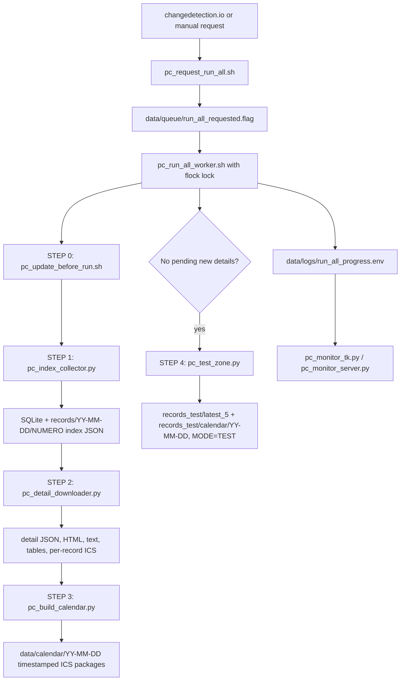

# PanamaCompra Collector

A local monitoring and archival system for **PanamaCompra** opportunities.

It watches the PanamaCompra *Cotizaciones en Línea* table, detects new or changed
opportunities, stores each one under its stable `NUMERO`, and optionally downloads
the full detail page into a local archive.

The project targets a **low-resource Linux workstation**: it never runs parallel
browser sessions and performs the index scan and detail download sequentially.

---

## Table of contents

1. [What it does](#what-it-does)
2. [How it works](#how-it-works)
3. [Design decisions](#design-decisions)
4. [Installation](#installation)
5. [Usage](#usage)
6. [Scripts reference](#scripts-reference)
7. [Configuration](#configuration)
8. [Data and storage](#data-and-storage)
9. [changedetection.io and the webhook](#changedetectionio-and-the-webhook)
10. [Monitoring and logs](#monitoring-and-logs)
11. [Troubleshooting](#troubleshooting)
12. [Security notes](#security-notes)
13. [Development](#development)

---

## What it does

The system collects and archives public opportunities from PanamaCompra. For each
opportunity it stores:

- `NUMERO` (the stable unique id), status group (`Programadas` / `Abiertas`), status
- Description, entity, dependency, table date, modality
- Detail URL, full detail HTML and visible text
- JSON metadata, plus one JSON file per table found in the detail page
- An estimated closing/finish date when one can be detected from the detail text

The unique identifier is always the PanamaCompra `NUMERO`, e.g. `2026-0-07-02-02-CL-058693`.
Visual row number and page number are intentionally **ignored** — they change whenever
new opportunities are inserted at the top of the table.

---

## How it works

```text
changedetection.io          detects a change in the PanamaCompra table
        │
        ▼
webhook_listener.py         receives the webhook
        │
        ▼
run_collector.sh            requests the full collector sequence
        │
        ▼
pc_request_run_all.sh       creates data/queue/run_all_requested.flag
        │
        ▼
pc_run_all_worker.sh        single locked worker
        │
        ├─ STEP 0  pc_update_before_run.sh fast-forwards local checkout before each run
        ├─ STEP 1  pc_index_collector.py   scans Programadas + Abiertas + pagination
        ├─ STEP 2  pc_detail_downloader.py downloads pending detail pages
        ├─ STEP 3  pc_build_calendar.py     writes timestamped .ics packages for new events
        └─ STEP 4  pc_test_zone.py          only when no new records: re-runs the last 5 in a sandbox
        │
        ▼
records/YY-MM-DD/[finish]-[NUMERO]-[desc]/    NUMERO.json, NUMERO.detail.{json,html,txt}, NUMERO.calendar.ics, tables/*.json
records_test/…                                isolated testing sandbox (shown as MODE=TEST in the monitor)
data/calendar/YY-MM-DD/YY-MM-DD_HH-MM_panamacompra_calendar_001.ics  normal-run import packages
```

### Process diagram and test visibility



The monitor now shows separate `normal_run` and `test_run` flags, plus worker/index/detail/calendar flags. Normal live runs show `MODE=LIVE`; the isolated test zone shows `MODE=TEST`, so it is visible when the worker is exercising code paths without touching the real archive.

The workflow has two phases run back-to-back by the worker:

| Phase | Script | Work |
|-------|--------|------|
| **Pre-run update** | `pc_update_before_run.sh` | Before each worker iteration, auto-stash any local edits to tracked files, fast-forward the local Git checkout (reset to remote if diverged), refresh installed Python requirements when `.venv` exists, and fix executable bits. Untracked runtime files never block it. If the update fails (e.g. no network), the worker logs a warning and **still runs** the collection with the current code instead of skipping. Set `PC_RUN_UPDATE_BEFORE_RUN=0` to skip the update entirely. |
| **Index scan** | `pc_index_collector.py` | Open the table, select *Programadas*, set 50 rows/page, crawl all pages, repeat for *Abiertas*. Save lightweight index JSON + DB records. |
| **Detail download** | `pc_detail_downloader.py` | Read pending records from SQLite, visit each detail URL, save HTML / text / metadata / table JSON, mark as saved. |

> The current architecture is **run-all only**. The older queue-based system is
> deprecated and is not part of this repository.

---

## Design decisions

- **`NUMERO` is the primary key.** Row number, page number, changedetection history
  position and visual order are all unstable and are never used as identifiers.
- **Index and detail are split.** Scanning the table is light; downloading detail
  pages is heavy. Splitting them keeps browser work small at any one moment.
- **One browser process at a time.** The worker takes a `flock` lock. If a new
  trigger arrives while it is running, a request flag is left behind and the worker
  runs one more full sequence after it finishes — no duplicate Firefox sessions.
  If the worker exits before a clean shutdown, it restores the request flag so the
  next `pc_request_run_all.sh` start resumes pending database work instead of
  losing the interrupted task.
- **Immutable archive.** Existing JSON / HTML / text files are never overwritten;
  completed folders are skipped.

---

## Installation

The scripts resolve their own location, so the project can live in **any directory**
(`~/Apps/panamacompra-collector` is just the example used below).

### Requirements

- Linux (Debian / Ubuntu / Linux Mint recommended)
- Python 3.10+ (3.12 used in development)
- Playwright Firefox browser — install it in the active virtualenv with
  `python -m playwright install firefox`
- Shell tools: `bash`, `flock`, `timeout`, `pgrep`, `pkill`, `tail`, `sed`, `grep`, `find`, `date`, `tee`, and a desktop opener such as `xdg-open` for opening the test sandbox folder after monitor-launched tests
- Optional: `sqlite3` CLI for manual inspection


### Updating an existing local copy

On the workstation, update the existing checkout safely with:

```bash
cd ~/Apps/panamacompra-collector
./update_local_copy.sh
```

The update script always brings the checkout up to date. It stops active collector
workers, **auto-stashes** any local edits to *tracked* files (kept in the stash for
recovery, never lost), ignores untracked runtime files (`data/`, `records/`,
`.webhook_token`, `.venv.broken.*`, …), fast-forwards the current branch, refreshes
the Python virtual environment dependencies, fixes executable bits, and runs the
system review. It uses `git pull --ff-only`; if the local branch has diverged and a
fast-forward is impossible, it resets the branch to the remote (diverging commits stay
reachable via `git reflog`), so an unattended update never stops half-way. To request
a small smoke run after the update, use:

```bash
cd ~/Apps/panamacompra-collector
PC_UPDATE_TEST_DETAIL_LIMIT=5 ./update_local_copy.sh
```

#### Recovering from a blocked merge or PR checkout

If Git reports `Merging is not possible because you have unmerged files`, finish or
abandon the in-progress merge before trying another branch. The safest recovery path
on the workstation is:

```bash
cd ~/Apps/panamacompra-collector
git status --short --branch
git merge --abort
git fetch --all --prune
git checkout main
git pull --ff-only origin main
```

Then switch to the branch you want to test and update it from the refreshed `main`.
Run the merge only if the checkout command succeeds:

```bash
gh pr checkout 3
git merge main
# If conflicts are reported, edit the listed files, then:
git status --short
git add <resolved-files>
git commit
```

If `gh pr checkout 3` says the branch has diverged or cannot fast-forward, the PR
branch was likely force-pushed after your local checkout was created. If you do not
need to preserve local commits on that PR branch, reset the local branch to the
remote PR branch and try again:

```bash
git merge --abort 2>/dev/null || true
git checkout main
git branch -D codex/fix-progress-bar-bugs-in-monitor-hein5x
git fetch origin codex/fix-progress-bar-bugs-in-monitor-hein5x
git checkout -B codex/fix-progress-bar-bugs-in-monitor-hein5x \
  origin/codex/fix-progress-bar-bugs-in-monitor-hein5x
git merge main
```

After any failed checkout or merge, stop and re-run `git status --short --branch`
before continuing. Do not run the next merge command if the checkout command failed,
because it may merge into whichever branch is currently checked out.

A message such as `not something we can merge` usually means the branch name is not
available locally. Fetch it first, or merge the remote-tracking name directly, for
example `git fetch origin codex/review-project-for-enhancements-e8vmmy` followed by
`git merge origin/codex/review-project-for-enhancements-e8vmmy`.

### Setup

```bash
cd ~/Apps/panamacompra-collector

# System packages: browser + complete Python venv support + optional Tk monitor
sudo apt update && sudo apt install -y python3-venv python3-full python3-tk

# Python environment
python3 -m venv .venv
source .venv/bin/activate
python -m pip install --upgrade pip
python -m pip install -r requirements.txt

# Browser engine used by the collectors
python -m playwright install firefox
```

`requirements.txt` intentionally lists only pip-installable Python modules. The
collector's non-stdlib runtime module is `playwright`; `tkinter` and the Python
stdlib extension `_posixsubprocess` come from the operating-system Python
packages above. If an existing `.venv` fails with `ModuleNotFoundError:
_posixsubprocess`, install `python3-venv` / `python3-full` and rerun
`./update_local_copy.sh`; the updater detects an incomplete `.venv`, moves it to
`.venv.broken.YYYYMMDD_HHMMSS`, and recreates a clean one.

Operational shell wrappers use the repository `.venv` when it exists and fall
back to `python3` when it does not. The status/stop/monitor scripts recognize
collector processes launched by either `python` or `python3`. The local updater
verifies that Playwright Firefox can launch and installs it automatically unless
`PC_UPDATE_SKIP_BROWSER_INSTALL=1` is set.

---

## Usage

All commands assume you are in the project directory.

```bash
# Run a small full sequence (index + 5 detail pages) and open the native monitor
./pc_request_run_all.sh 5
./pc_open_monitor.sh   # native Tk window; no Firefox/web browser

# Run the full sequence (index + all pending detail pages)
./pc_request_run_all.sh

# Run the worker in the foreground (this terminal)
./pc_run_all_now.sh 5

# Check status
./pc_run_all_status.sh

# Follow the logs live
./pc_follow_run_all.sh

# Emergency stop collector processes only; webhook stays alive for changedetection autorun
./pc_stop_run_all.sh

# Stop the webhook too only when intentionally disabling autorun
PC_STOP_WEBHOOK=1 ./pc_stop_run_all.sh
```

You can also run a single phase manually:

```bash
source .venv/bin/activate
./pc_index_collector.py                 # index scan only
PC_DETAIL_LIMIT=5 ./pc_detail_downloader.py   # download up to 5 pending details
```

---

## Scripts reference

| Script | Role |
|--------|------|
| `pc_common.py` | Shared module: paths, DB schema, JSON helpers, URL/date detection. **Not run directly.** |
| `pc_index_collector.py` | Index scan. Crawls Programadas + Abiertas, writes index JSON and DB records. |
| `pc_detail_downloader.py` | Detail download. Saves HTML/text/metadata/tables for pending records. |
| `pc_request_run_all.sh` | **Main entry point.** Requests a full run and starts the worker if idle. |
| `pc_run_all_worker.sh` | Locked sequential worker: pre-run update, index, detail, calendar packaging, optional test zone; repeats if re-requested. A failed pre-run update only logs a warning — the worker still collects with the current code. |
| `pc_update_before_run.sh` | Lightweight pre-run updater called by the worker before every iteration; auto-stashes local tracked edits, fast-forwards Git (reset to remote if diverged) and refreshes requirements without stopping the active worker. Untracked runtime files never block it. |
| `pc_waha_notify.py` | Optional dependency-free WAHA notifier for short operational WhatsApp alerts (start/done/failed/…). Enabled only when WAHA environment variables are configured. |
| `pc_notify_new_records.py` | WhatsApp (WAHA) notifier helpers. `pc_detail_downloader.py` calls them to announce each new record in real time as its detail saves (“🟢 NUEVA OPORTUNIDAD DETECTADA”); the worker calls it with `--idle` (“⚪ Sin nuevas entradas”) or `--flush` (retry failed sends). Supports an optional keyword filter and a first-use baseline so the existing archive is never re-announced. |
| `pc_run_all_now.sh` | Runs the worker in the foreground for interactive use. |
| `run_collector.sh` | Bridge called by the webhook listener; requests a full run. |
| `webhook_listener.py` | Local HTTP listener for changedetection.io notifications. |
| `pc_monitor_tk.py` | Preferred lightweight native Tk monitor window with a vertical scrollbar; no Firefox/browser or web server required. Its manual buttons are grouped into Runners, Tests, Updater / Migration, and Settings zones, with stop buttons and test-sandbox folder opening after test-zone completion. |
| `pc_next_run_timer.py` | Always-on-top timer centered near the top of the desktop (about 30 px down) counting down to the next live run, with previous run index/detail counters. The countdown is anchored to the **last live run's start time** (from `run_all_progress.env`) plus the interval, so it tracks the real cadence and rolls forward if a run is overdue; it falls back to clock boundaries when no previous run is recorded. Withdraws while a live run is active and reappears when finished. |
| `pc_monitor_server.py` | Optional local browser monitor at `http://127.0.0.1:8766/`; loads once, polls lightweight JSON, mirrors the Tk button zones/stop controls, and auto-closes only after completed live runs. |
| `pc_monitor_window.sh` | Optional live terminal progress monitor; auto-closes when idle. |
| `pc_open_monitor.sh` | Opens/starts the native Tk monitor and the tiny next-run timer by default. Set `PC_MONITOR_MODE=web` for browser monitor or `PC_MONITOR_MODE=terminal` for terminal monitor. |
| `pc_run_all_status.sh` | One-shot status snapshot. |
| `pc_stop_run_all.sh` | Emergency stop for stuck index/detail/worker processes. |
| `pc_follow_run_all.sh` | `tail -f` of the worker and current-run logs. |
| `migrate_previous_records.py` / `.sh` | Migrate old flat `records/NUMERO/` folders into dated archive folders; detail download then renames them to `[finish]-[NUMERO]-[desc]`. |
| `pc_rename_record_folders.py` | Rename record folders to `[finish]-[numero]-[desc]` from already-saved data. Dry-run by default; `--apply` to act. |
| `pc_build_detail_views.py` | Backfill the `summary` / numbered `items` / `calendar` views into existing `detail.json` files from saved text/tables (browser-free). Dry-run by default; `--apply` to act. |
| `pc_update_day_folder.py` | Manually **re-download** every record in a `YY-MM-DD` day folder from the live portal (overwriting saved HTML/text/detail JSON/calendar ICS/tables) to refresh records pulled under an earlier portal version. Prompts for the day (default today) or takes `--date`; lists and asks before downloading, or `--apply` to skip the prompt. |
| `pc_build_calendar.py` | Build timestamped `.ics` import packages from new/changed detail calendars under `data/calendar/YY-MM-DD/`, defaulting to 10 events per file. Runs automatically as STEP 3 after each detail step; use `--all` to package every saved record, `--flat` for the old parent-only layout, or `--legacy-combined` to also write the old single combined file. |
| `pc_test_zone.py` | **Testing zone.** Re-run the last N records (default 5) through the full pipeline in an isolated sandbox (`records_test/latest_5/`, throwaway DB, test calendar packages under `records_test/calendar/YY-MM-DD/`), leaving the real archive untouched. Runs automatically as STEP 4 when a run finds no new records; the monitor shows `MODE=TEST` and the `test_run` flag. |
| `review_panamacompra_system.sh` | Health check: required scripts, compile/syntax checks, process and status review. |
| `update_local_copy.sh` | In-place updater for an existing checkout that always brings it up to date: stop **only the collector pipeline + webhook trigger** (never the updater/loader/monitor themselves, which previously caused the update to freeze or close on itself), auto-stash local tracked edits (kept for recovery), **auto-select the branch** (track `main` when the most recently updated remote branch is already merged into `main`, otherwise switch to that latest branch), reset to the remote, refresh dependencies, run health checks, and install the Update + Monitor desktop shortcut. Runtime data (`data/`, `records/`, `.venv`) is protected by `.gitignore` so the reset/`git clean` can never delete the archive or database. |
| `pc_update_loader.py` | Separate centered Tk updater loader window for desktop/manual updates. Appears first with a step-based progress bar, tails the update output, and opens the monitor only **after** the update finishes so the monitor reflects the already-updated code. |

---

## Configuration

Behavior is controlled with environment variables (all optional):

| Variable | Default | Used by | Meaning |
|----------|---------|---------|---------|
| `PC_MAX_PAGES_PER_GROUP` | `20` | index collector | Max pages crawled per status group. |
| `PC_DETAIL_LIMIT` | `10` | detail downloader | Max detail pages per run. |
| `PC_MAX_DETAIL_ATTEMPTS` | `5` | detail downloader | A record that fails this many times is no longer retried. |
| `PC_DESC_SLUG_MAX` | `24` | folder naming | Max length of the `[description]` token in the record-folder name. |
| `PC_RENAME_AFTER_DETAIL` | `1` | detail downloader | Auto-rename each folder to `[finish]-[numero]-[desc]` after a successful detail save. Set `0` to keep `<numero>`. |
| `PC_CALENDAR_TZ` | `America/Panama` | detail views | Timezone recorded in each record's `calendar` event. |
| `PC_CALENDAR_ATTENDEES` | `a2gutierrezmora@gmail.com,razelgutierrez@gmail.com` | detail views | Comma-separated attendee emails for the `calendar` event. |
| `PC_CALENDAR_PACKAGE_SIZE` | `10` | calendar builder | Maximum events per timestamped import package. Smaller packages reduce calendar-import reminder/edit overload. |
| `PC_CALENDAR_AUTO_IMPORT` | unset | calendar builder | Set to `1` to automatically open each generated `.ics` package after it is written. If `PC_CALENDAR_THUNDERBIRD_PROFILE` is set, Thunderbird is preferred; otherwise the desktop opener (`xdg-open`, `gio open`, or macOS `open`) is used. |
| `PC_CALENDAR_THUNDERBIRD_PROFILE` | unset | calendar builder | Thunderbird profile name for calendar imports, e.g. `a2gutierrezmora`. When set with `PC_CALENDAR_AUTO_IMPORT=1`, packages are opened as `thunderbird -P <profile> <package.ics>`. |
| `PC_CALENDAR_THUNDERBIRD_CMD` | `thunderbird` | calendar builder | Thunderbird executable/command used with `PC_CALENDAR_THUNDERBIRD_PROFILE`. |
| `PC_CALENDAR_AUTO_IMPORT_CMD` | unset | calendar builder | Optional command run once per written `.ics` package, with the package path appended, for local auto-import/open workflows. Overrides the default opener and Thunderbird profile command. |
| `PC_WEBHOOK_DETAIL_LIMIT` | `99` | `run_collector.sh` | Detail limit per webhook-triggered run (also the default for the run-all worker / `pc_request_run_all.sh`). |
| `PC_TEST_ZONE_LIMIT` | `5` | run-all worker | How many recent records the idle testing zone (STEP 4) re-runs in the sandbox. `0` disables it. |
| `PC_RUN_UPDATE_BEFORE_RUN` | `1` | run-all worker | Run `pc_update_before_run.sh` before every worker iteration. Set `0` to skip automatic pre-run updates. |
| `PC_UPDATE_REMOTE` | `origin` | update scripts | Git remote used by `update_local_copy.sh` and `pc_update_before_run.sh`. |
| `PC_UPDATE_BRANCH` | auto-detect | update scripts | Optional **hard override** that pins the branch to track. When empty (default), `update_local_copy.sh` auto-selects: it stays on `main` if the most recently updated remote branch is already merged into `main`, otherwise it switches to that latest branch. `pc_update_before_run.sh` uses it (or the current branch) for its lightweight refresh. |
| `PC_UPDATE_TEST_DETAIL_LIMIT` | `0` | `update_local_copy.sh` | Optional smoke-run detail limit to request after a successful local update. |
| `PC_UPDATE_SKIP_BROWSER_INSTALL` | `0` | `update_local_copy.sh` | Set to `1` to skip automatic Playwright Firefox install during local updates. |
| `PC_UPDATE_INSTALL_MONITOR_SHORTCUT` | `1` | `update_local_copy.sh` | Installs/refreshes the **PanamaCompra Update + Monitor** desktop/application-menu shortcut. The shortcut opens the separate updater loader first, then starts the native monitor. Set to `0` to skip. |
| `PC_WEBHOOK_HOST` | `0.0.0.0` | webhook listener | Bind address. Keep `0.0.0.0` for Docker; use `127.0.0.1` to restrict to localhost. |
| `PC_WEBHOOK_PORT` | `8765` | webhook listener | Listen port. |
| `PC_STOP_WEBHOOK` | `0` | stop script | By default `pc_stop_run_all.sh` preserves `webhook_listener.py` so changedetection.io autorun keeps working. Set `PC_STOP_WEBHOOK=1` only when you intentionally want to stop the webhook receiver too. |
| `PC_MONITOR_MODE` | `tk` | monitor opener | `tk` opens the native Tk monitor; `web` starts the browser monitor; `terminal` tries the old graphical-terminal monitor. |
| `PC_MONITOR_LAUNCH_CONTEXT` | `manual` | monitor opener | Internal/manual override for auto-close behavior. `pc_request_run_all.sh` sets `auto` so normal or scheduled live runs close after all tasks are done; direct manual monitor launches stay open. |
| `PC_MONITOR_TK_REFRESH_SECONDS` | `3` | native monitor | Native Tk monitor refresh interval while a run is active. Minimum is 2 seconds. |
| `PC_MONITOR_TK_IDLE_REFRESH_SECONDS` | `15` | native monitor | Slower native Tk refresh interval after the system is idle/done. |
| `PC_MONITOR_TK_AUTO_CLOSE_SECONDS` | `20` | native monitor | Seconds to count down (centered on screen) after an automatic/scheduled LIVE run finishes before the native monitor closes itself. Manual monitor launches (`./pc_open_monitor.sh`) stay open; auto-close is enabled when `pc_request_run_all.sh` opens the monitor with `PC_MONITOR_LAUNCH_CONTEXT=auto`. Set `0` to disable. |
| `PC_MONITOR_TK_GEOMETRY` | `980x760` | native monitor | Initial native monitor window size; the window is centered automatically. |
| `PC_MONITOR_TK_ALPHA` | `0.85` | native monitor | Native monitor whole-window opacity (text shares it; Tk has no per-widget transparency). `0.85` is lightly translucent but readable; lower toward `0.30` for a more see-through window (clamped to 0.30–1.00). Editable live from the monitor's Settings panel; re-applied after the window is visible so it works on X11 WMs. |
| settings file | `data/config/monitor_settings.env` | native monitor / WAHA notifier | `KEY=VALUE` file written by the monitor's Settings panel (transparency, auto-close/refresh seconds, WAHA source label). Read at startup and by the notifier. Precedence: environment variable > this file > built-in default. |
| `PC_NEXT_RUN_TIMER` | `1` | monitor opener | Starts the tiny next-run timer together with the Tk monitor. Set to `0` to disable. |
| `PC_NEXT_RUN_INTERVAL_MINUTES` | `30` | next-run timer | Countdown interval for scheduled live runs. |
| `PC_NEXT_RUN_TIMER_TOP` | `30` | next-run timer | Pixels from the top edge of the screen for the timer window. |
| `PC_NEXT_RUN_TIMER_WIDTH` | `420` | next-run timer | Width of the timer window. Increase if desktop font scaling cuts text. |
| `PC_NEXT_RUN_TIMER_HEIGHT` | `232` | next-run timer | Height of the timer window. Increase if extra status lines are clipped. |
| `PC_MONITOR_HOST` | `127.0.0.1` | web monitor | Bind address for the local web monitor. |
| `PC_MONITOR_PORT` | `8766` | web monitor | Port for the local web monitor. |
| `PC_MONITOR_WEB_REFRESH_SECONDS` | `3` | web monitor | Lightweight JSON polling interval while a run is active. Minimum is 3 seconds. |
| `PC_MONITOR_WEB_IDLE_REFRESH_SECONDS` | `30` | web monitor | Slower JSON polling interval after the system is idle/done. |
| `PC_MONITOR_WEB_AUTO_CLOSE_SECONDS` | `20` | web monitor | Seconds to wait after an automatic/scheduled LIVE run completes before a web monitor tab opened with `?auto_close=1` tries to close. Manual web monitor tabs stay open. Use `0` to disable. |
| `PC_MONITOR_REFRESH_SECONDS` | `5` | terminal monitor | Poll interval for process/log changes. The screen only redraws when state changes or the force-redraw interval elapses. |
| `PC_MONITOR_FORCE_REDRAW_SECONDS` | `30` | monitor | Maximum seconds between redraws while the monitor is open, even if no state changed. |
| `PC_MONITOR_IDLE_CLOSE_SECONDS` | `8` | monitor | Delay before auto-closing once idle. |
| `PC_MONITOR_STABLE_DONE_CYCLES` | `3` | monitor | Idle cycles required before closing. |
| `WAHA_ENABLED` / `PC_WAHA_ENABLED` | unset | WAHA notifier | Set `WAHA_ENABLED=true` (or legacy `PC_WAHA_ENABLED=1`) to enable private WhatsApp group alerts. If no group chat id is configured, notifications are skipped safely. |
| `PC_WAHA_BASE_URL` | `http://127.0.0.1:3000` | WAHA notifier | Base URL for the self-hosted WAHA HTTP API. |
| `PC_WAHA_SESSION` | `default` | WAHA notifier | WAHA session name to use when sending messages. |
| `WAHA_GROUP_CHAT_ID` / `PC_WAHA_CHAT_ID` | unset | WAHA notifier | Destination WhatsApp group chat id for automated NEW/UPDATED alerts. If unset, `data/config/waha_chat_id.txt` saved from the monitor is used. Group ids usually end in `@g.us`. |
| `WAHA_API_KEY_PLAIN` / `WAHA_API_KEY` / `PC_WAHA_API_KEY` | unset | WAHA notifier | Optional WAHA `X-Api-Key` value when the WAHA server requires it. `WAHA_API_KEY_PLAIN` wins when both key names exist. The monitor can save a local key to `data/config/waha_api_key.txt` (ignored by git). |
| `PC_WAHA_NOTIFY_EVENTS` | `info,start,done,failed,timeout,resume,update,new,none` | WAHA notifier | Comma-separated event names to send. `new` = rich NEW opportunity messages, `update` = rich UPDATED opportunity messages, `none` = “sin nuevas entradas” status. Use `all` to send every supported event. |
| `PC_WAHA_STRICT` | `0` | WAHA notifier | Set `1` only if notification failures should fail the notifier command. Worker calls still ignore notifier failures. |
| `PC_WAHA_SOURCE` | `Panamá Compra` | new-record notifier | Source label shown as `📌 Fuente:` in the rich opportunity / “sin nuevas entradas” messages. |
| keyword filter | `data/config/waha_keywords.txt` | new-record notifier | Optional, one keyword per line. When present only matching new records are announced; matched keywords appear in `🔎 Coincidencia`. |
| notify baseline | `data/config/waha_notify_initialized` | new-record notifier | Marker written on first run so the existing archive is not announced as “new”. Delete it to re-baseline. |
| saved WAHA destination | `data/config/waha_chat_id.txt` | WAHA notifier / monitor | Destination group/channel chat id saved from the monitor; used when `PC_WAHA_CHAT_ID` is not set. |
| saved WAHA message | `data/config/waha_message.txt` | WAHA notifier | Optional reusable message body saved by `pc_waha_notify.py --save-message`; used on later notifications when no one-off message is passed. |

The detail limit can also be passed positionally: `./pc_request_run_all.sh 5`. The native and web monitors include buttons to request a run immediately and to save the WhatsApp group/channel destination that receives automated “what is new” messages for current and future runs.

#### Native monitor layout

The native Tk monitor is organized top-to-bottom into clear sections:

1. **Run controls** — choose `live`/`test` mode and the detail/sandbox limit, then request the run.
2. **Settings (editable)** — entry fields pre-filled with the current values; change what you need and leave the rest, then click **Apply & save settings**:
   - Window transparency (`0.30`–`1.00`, default `0.85`; lower it for a more see-through window) — applied live.
   - Auto-close seconds, active refresh seconds, idle refresh seconds — applied live.
   - WhatsApp source label, destination group chat id, WAHA API key field, and keyword filter.
   - Values persist to `data/config/monitor_settings.env` (and the WhatsApp chat id/keywords to their own files), so they survive restarts and are picked up by the notifier.
3. **Diagnostic fields** — live phase/status/record counters.
4. **Manual script buttons** — grouped by zone (Collector Runners → Updater & Migration → Data Tools → Testing & Validation → Folder Management) in a compact grid. **Hover any button** to see a tooltip explaining exactly what it does before clicking.
5. **Recent worker / current action logs**.

Transparency, refresh cadence and the auto-close countdown can all be changed from the Settings panel without restarting the monitor.

### Optional WAHA private WhatsApp group alerts

This project can send short text alerts to a private WhatsApp group through a
self-hosted WAHA server. WAHA exposes `POST /api/sendText` with a JSON body that
includes `session`, `chatId`, and `text`; group chat ids normally end in `@g.us`.
The notifier is off by default and uses only Python's standard library.

Example local configuration:

```bash
export WAHA_ENABLED=true
export WAHA_BASE_URL="http://127.0.0.1:3000"
export WAHA_SESSION="default"
export WAHA_GROUP_CHAT_ID="120363175324031424@g.us"
# Optional, if your WAHA server is protected. Plain key wins when both exist:
export WAHA_API_KEY_PLAIN="your-waha-api-key"
```

Test the notifier without running the collector:

```bash
./pc_waha_notify.py --event info --status TEST --message "PanamaCompra WAHA test"
```

Keep this group private and low-volume. WAHA is a WhatsApp Web style automation
bridge, not the official WhatsApp Business Cloud API, so the safest use is a
private alert group controlled by you.

#### Rich “what is new” opportunity messages

In addition to the short operational alerts above (`start`/`done`/`failed`/…),
new opportunities are announced **in real time**: `pc_detail_downloader.py` sends
one WhatsApp message for each brand-new record **immediately after its detail page
finishes downloading** (so every field is populated), then continues to the next
new entry and repeats. The message uses this template:

```text
🟢 NUEVA OPORTUNIDAD DETECTADA

📌 Fuente: Panamá Compra
🏷️ Título: {descripcion}
🏢 Entidad: {entidad}
📍 Provincia: {provincia_de_entrega}
📅 Publicado: {fecha}
⏰ Cierre: {finish_date_guess}
💰 Monto estimado: {precio_estimado}

🔎 Coincidencia: {matched_keywords}

🔗 Ver oportunidad:
{link}

🕒 Detectado: {detail_saved_at}
🆔 ID: {numero}
```

When a run completes with no new records, the worker sends a single status
message instead (`pc_notify_new_records.py --idle`):

```text
⚪ Sin nuevas entradas

📌 Fuente: Panamá Compra
🕒 Revisión: {checked_at}
📊 Registros revisados: {total_records}
✅ Monitor activo
```

Behavior notes:

- **One message per meaningful change.** NEW records are announced once right after detail saves. Existing records whose watched index fields change are marked `UPDATED`, clear `notified_at`, and are announced with an updated-opportunity heading. UNCHANGED rows keep their notification state and are not re-sent.
- **No backlog flood.** On first use (before any new detail is downloaded)
  `ensure_baseline` marks every existing saved record as already-announced via
  the `notified_at` column and writes `data/config/waha_notify_initialized`, so
  only records saved afterwards are announced.
- **Sent at most once per change.** Announcing is guarded by `notified_at`; unchanged records are not re-sent, while a later meaningful update intentionally clears `notified_at` so the update can be alerted.
- **Optional keyword filter.** Put one keyword per line in
  `data/config/waha_keywords.txt`. When present, only records whose
  title/description/entity match a keyword are announced and the matched
  keywords are listed in `🔎 Coincidencia`. When the file is missing or empty,
  every new record is announced and the line reads
  `Sin filtro (todas las entradas)`.
- **Never blocks a run.** Any notifier or network failure is caught and logged;
  records whose live send failed keep `notified_at` empty and are retried by the
  end-of-run flush (`pc_notify_new_records.py --flush`) or the next run.
- **Config.** Requires `WAHA_ENABLED=true` (or legacy `PC_WAHA_ENABLED=1`), a WAHA server (default
  `http://127.0.0.1:3000`) and a destination chat id (`WAHA_GROUP_CHAT_ID`, legacy `PC_WAHA_CHAT_ID`, or the
  monitor's Settings panel, e.g. `120363175324031424@g.us`).

---

## Data and storage

### Folder layout

```text
panamacompra-collector/
├── *.py, *.sh, requirements.txt, README.md   # code (committed)
├── data/                                      # runtime data (gitignored)
│   ├── panamacompra_archive.db                # SQLite database
│   ├── panamacompra_index.csv                 # append-only "first seen" log
│   ├── logs/
│   └── queue/
└── records/                                   # archive (gitignored)
    └── YY-MM-DD/
        └── NUMERO/
            ├── NUMERO.json                     # index record
            ├── NUMERO.detail.json              # detail metadata
            ├── NUMERO.detail.html              # full page HTML
            ├── NUMERO.detail.txt               # visible text
            ├── NUMERO.calendar.ics             # importable calendar event
            └── tables/                         # one detail-page section -> three files:
                ├── NUMERO.table.<section>.001.json         # clean: headers/rows/key_values/links
                ├── NUMERO.table.<section>.001.raw.json     # raw rows
                └── NUMERO.table.<section>.001.raw_wL.json  # raw rows with links
```

`<section>` is a short identifier derived from the detail-page section heading
(e.g. `informacion-general`, `contacto-unidad-compra`, `items-cotizacion`). The
per-table index — section, identifier and the three filenames — is also listed in
`detail.json` under `tables`. Timestamped files under `data/calendar/YY-MM-DD/` hold small import packages for calendar apps. The normal worker exports only events from records written in that run, so you can import each package once without re-importing the entire archive. To auto-open/import generated packages on a desktop machine, set `PC_CALENDAR_AUTO_IMPORT=1` or provide a custom `PC_CALENDAR_AUTO_IMPORT_CMD`.

> `panamacompra_index.csv` is written once per `NUMERO` at first insert and is **not**
> updated afterwards, so it is a first-seen log, not a mirror of current state. Query
> the SQLite database for the live picture.

### Record folder naming

Folders are created as `NUMERO` during the index scan, then renamed to encode the
key facts once detail data is available:

```text
records/YY-MM-DD/[<finish>]-[<numero>]-[<desc>]/
              e.g. [2022-10-11_12:00]-[2022-0-12-214-12-CL-008498]-[FRS-126-CMPRS-D-CJ-PLSTC]
```

- **`<finish>`** = `YYYY-MM-DD_HH:MM` when proposals stop being accepted: the **end**
  time of the *"Fecha y hora presentación de cotizaciones"* window (24-hour). For older
  records without that field, the delivery (*entrega*) date at `12:00` is used. Empty `[]`
  if no date can be found.
- **`<numero>`** = the PanamaCompra `NUMERO`, unchanged.
- **`<desc>`** = the request description, accent-stripped, uppercased, with **vowels
  removed**, each run of non-alphanumerics collapsed to one `-`, truncated to `PC_DESC_SLUG_MAX` chars.

New records are renamed automatically by the detail downloader after each successful
save (disable with `PC_RENAME_AFTER_DETAIL=0`). To rename folders that already exist on
disk, run the tool below (reads only saved files, no network):

```bash
./pc_rename_record_folders.py            # dry-run: preview every planned rename
./pc_rename_record_folders.py --apply    # rename folders and update the database
```

It is idempotent (already-named folders are skipped) and never overwrites an existing
target. Inner files keep their `NUMERO.*` names.

#### Keeping new and previous records in the same format

There are two supported paths, and both converge on the same
`[finish]-[numero]-[desc]` leaf format:

1. **New records** — run the normal collector. The index scan first creates a
   temporary `records/YY-MM-DD/NUMERO/` folder; once detail data is downloaded,
   `pc_detail_downloader.py` computes the finish stamp and description from the
   detail text/tables and automatically renames the folder.
2. **Previous records already on disk** — run `pc_rename_record_folders.py`. It
   reads the saved `NUMERO.detail.txt` and `tables/*.json`, previews the same
   target name in dry-run mode, and applies the rename only with `--apply`.
   If a previous folder only has the index `NUMERO.json`, run
   `pc_update_day_folder.py --date YY-MM-DD --apply` to fetch its detail page
   first; the day updater syncs those index-only folders into SQLite before it
   lists records to download.

Recommended review/test commands before and after applying updates:

```bash
# 1) Preview old-folder renames without changing files
./pc_rename_record_folders.py --limit 20

# 2) Apply old-folder renames after the preview looks right
./pc_rename_record_folders.py --apply

# 3) Preview detail view/calendar backfill for previous records
./pc_build_detail_views.py

# 4) Apply detail view/calendar backfill for previous records
./pc_build_detail_views.py --apply

# 5) Test new records with a small live run, then check the resulting folder name
./pc_request_run_all.sh 5
./pc_run_all_status.sh
```

Use `pc_update_day_folder.py --date YY-MM-DD --apply` when previous records
need to be **fetched/re-fetched from the live portal** instead of just renamed
or rebuilt from saved detail files. This includes index-only folders that have
`NUMERO.json` but do not yet have `NUMERO.detail.json`, `NUMERO.detail.html`,
or `NUMERO.detail.txt`.

### Detail tables and links

- Each two-column detail table also gets a **`key_values`** object
  (`{"Fecha y hora presentación de cotizaciones": "19-06-2026 - 08:00 AM a 12:00 PM", …}`)
  alongside the existing row arrays.
- Saved links are filtered to the **useful** ones only — document attachments
  (`pdf`/`doc`/`xls`/`zip`/…) and real PanamaCompra opportunity/portal URLs — dropping
  navigation, in-page `#/` router links, `mailto:`/`javascript:`, and asset noise.
  Already-saved archives are re-cleaned automatically from their stored HTML on the next
  run (no re-download).

### Detail summary, items, and calendar

Each `detail.json` also carries three structured views, parsed from the saved detail
text (and the on-page items grid). They hold the same facts the old `SUMMARY.csv` /
`items.csv` / `.ics` artifacts did, but in one JSON document:

- **`summary`** — curated key facts: `numero`, `descripcion`, `objeto_de_la_contratacion`,
  `entidad`, `dependencia`, `unidad_de_compra`, `direccion`, `provincia_de_entrega`,
  `contacto` (`nombre`/`cargo`/`telefono`/`correo_electronico`), `forma_de_entrega`,
  `dias_de_entrega`, `forma_de_pago`, `dia_y_hora_de_entrega`, `precio_estimado`,
  `enlace_publico`, `enlace_interno`.
- **`items`** (+ **`items_count`**) — the **numbered** item list: each entry has `r`,
  `codigo`, `clasificacion`, `cantidad`, `unidad_de_medida`, `descripcion`, `ses`.
  Códigos and clasificación come from the on-page items grid when present; otherwise
  quantity/unit/description are read from the detail text (códigos left blank).
- **`calendar`** — an ICS `VEVENT` expressed as JSON: `uid`, `summary`, `dtstart`/`dtend`
  (the **presentación de cotizaciones** / cierre / límite window in 24-hour — start and
  end on its date; older records fall back to the *Día y Hora de Entrega* window),
  `timezone`, `location` (`(Provincia) - (Dirección de la unidad de compra)`),
  `organizer` (the record's contact), `attendees`, `url_publico` (the record's link),
  `url_interno`, `precio_estimado`, and a blank-line-separated `description`
  (`LINK :`, `DESCR:`, then an `ITEMS:` list). A sibling `NUMERO.calendar.ics` file
  is also written so the event can be imported into a calendar app later.
- **`fields_detected`** — the `Label → value` pairs parsed from the detail text. Both the
  current **V3** portal (tab-separated `Label⇥Value`) and older `Label: value` /
  label-on-its-own-line layouts are supported.

New records get these automatically when first downloaded. A normal run only processes
**new** records — it never re-pulls or rewrites records that were already downloaded,
even after the parsing rules change. Refresh previously-downloaded records **manually**:

```bash
./pc_build_detail_views.py            # dry-run: preview every record
./pc_build_detail_views.py --apply    # rebuild views + .ics from saved files (no browser)
./pc_update_day_folder.py --date <YY-MM-DD> --apply   # re-download a day from the portal
```

Calendar timezone and attendees are configurable with `PC_CALENDAR_TZ` and
`PC_CALENDAR_ATTENDEES`. The JSON calendar view is the source of truth; the
`.calendar.ics` file is a portable review/import copy generated during detail
downloads, day-folder refreshes, and `pc_build_detail_views.py --apply`. In the
ICS export, each event's `ATTENDEE:MAILTO:...` lines sit inside its `VEVENT`,
`DTSTART` / `DTEND` use `TZID=<timezone>;VALUE=DATE-TIME` (e.g.
`DTSTART;TZID=America/Panama;VALUE=DATE-TIME:20260619T100000`), `DTSTAMP` ends
with a trailing `Z`, organizer lines include quoted `CN` and `ROLE` parameters
when available, `LOCATION` is `(Provincia) - (Dirección de la unidad de compra)`,
and `DESCRIPTION` is a `LINK :` line, a `DESCR:` line, then an `ITEMS:` list
(blank-line separated). The record link is also set as the event `URL`, which
Thunderbird renders as a clickable link. (Commas in ICS text are written `\,` per
the spec and display unescaped in calendar apps.)

**Calendar import packages.** After each run, `pc_build_calendar.py` (STEP 3)
exports only the new/changed record calendars from that run into timestamped files:

```text
data/calendar/YY-MM-DD/YY-MM-DD_HH-MM_panamacompra_calendar_001.ics
data/calendar/YY-MM-DD/YY-MM-DD_HH-MM_panamacompra_calendar_002.ics
```

The default package size is **10 events per file** (`PC_CALENDAR_PACKAGE_SIZE=10`).
This is intentionally smaller than the old all-in-one calendar because Thunderbird
and other clients can become noisy when a single import contains too many reminders
or editable events. Import the packages produced by each run, then leave old
packages alone. If an imported ICS calendar shows reminders for a calendar you do
not want to edit, right-click that calendar in Thunderbird's calendar/task list,
open **Properties**, and mark it **read-only**.

Manual examples:

```bash
./pc_build_calendar.py                         # package only this run's new/changed records when PC_RUN_STARTED_AT exists
./pc_build_calendar.py --all                   # package every saved record under data/calendar/YY-MM-DD/
PC_CALENDAR_PACKAGE_SIZE=5 ./pc_build_calendar.py --all
./pc_build_calendar.py --all --flat            # write packages directly in data/calendar/
./pc_build_calendar.py --all --legacy-combined # also write data/calendar/panamacompra.ics
PC_CALENDAR_AUTO_IMPORT=1 PC_CALENDAR_THUNDERBIRD_PROFILE=a2gutierrezmora ./pc_build_calendar.py --all
```

The monitor's **Data Tools** section also includes **Import to Thunderbird a2gutierrezmora**, which runs the same Thunderbird-profile import command for generated packages.

> **Portal versions.** The collector reads the current
> `…/Inicio/#/solicitud-de-cotizacion/{numero}/{token}` pages (both *abierta* and
> *programada* states). Links to the previous-version preview
> (`…/Inicio/v2/#!/vistaPreviaCP?NumLc=…`) are recognized (classified `vista-previa`)
> and kept.

### Re-downloading a day folder

`pc_build_detail_views.py` and the automatic schema-version refresh only re-parse
**saved** HTML — they never go back to the portal. To actually re-fetch records from
the live site (for example, a day's records first captured under an earlier portal
version that you now want pulled as the current one), use:

```bash
./pc_update_day_folder.py                  # prompt for the day (default: today), then confirm
./pc_update_day_folder.py --date 26-06-18  # a specific day folder (YY-MM-DD or YYYY-MM-DD)
./pc_update_day_folder.py --date yesterday --apply
./pc_update_day_folder.py --apply          # today's folder, no confirmation
```

It selects every record whose `date_folder` matches (the day it was first seen),
lists them, and — after a confirmation, or immediately with `--apply` — force
re-downloads each one from its stored detail link, **overwriting** its saved HTML,
text, detail JSON, calendar `.ics`, and table JSONs, re-deriving the
summary/items/calendar views and re-naming the folder if the finish date, `NUMERO`,
or description changed. Without `--date` it prompts (defaulting to today)
and shows the day folders present in the database.

With `--apply`, Playwright is required. If the script was launched with a Python
environment that does not have Playwright, it first checks this checkout's
`.venv/bin/python`; when that interpreter has Playwright, the updater
automatically re-runs itself with the project virtualenv. If neither Python can
import Playwright, the error message prints the current interpreter, the checked
`.venv` path, and repair commands (`./update_local_copy.sh` or `source
.venv/bin/activate && python -m pip install -r requirements.txt`).

> Re-fetching uses each record's stored `link`. If the listing URLs may have changed,
> run an index scan first so links and `last_seen` are refreshed. The index scan
> also checks for an existing `NUMERO.json` anywhere under `records/YY-MM-DD/`,
> including renamed `[finish]-[numero]-[desc]` folders, before creating a new
> plain `NUMERO` folder. This prevents duplicate archives when the original
> `NUMERO/` leaf was already renamed after detail download.

### Testing zone

When a run finds **no new opportunities**, the pipeline normally does nothing, so a
code change cannot be observed. The testing zone fills that gap: it re-runs the most
recent **N records (default 5)** through the full pipeline in an **isolated sandbox**,
leaving the real archive and DB untouched, so you can see how the current code renders
them.

- Writes only to `records_test/latest_5/`, a throwaway in-memory DB, and test ICS packages under `records_test/calendar/YY-MM-DD/` — diff these against the real outputs.
- The run is published to the monitor as **`MODE=TEST`** (the monitor's *Mode* field
  shows `LIVE` vs `TEST`), with a *Test records* count, so it is clearly distinct from
  new (live) records.
- The run-all worker runs it automatically as **STEP 4**, but only when that run had
  no new records to process. Set `PC_TEST_ZONE_LIMIT=0` to disable, or a different
  number to change how many records are re-run.

Run it manually any time:

```bash
./pc_test_zone.py                 # list the last 5, then ask
./pc_test_zone.py --limit 5 --apply
```

Each run starts from a clean sandbox (the previous `records_test/` is cleared), and
the full pipeline runs — live re-download, section-table split, views, and timestamped test calendar packages — so browser extraction and parsing changes are both exercised.

### Database

SQLite database at `data/panamacompra_archive.db`, table `opportunities`
(primary key `numero`):

| Field | Notes |
|-------|-------|
| `numero` | Primary key. |
| `grupo`, `tipo_url`, `estado` | Status group, URL type, status. |
| `descripcion`, `short_description` | Full and shortened description. |
| `entidad`, `dependencia`, `fecha`, `modalidad` | Index table fields. |
| `link` | Detail URL. |
| `first_seen`, `last_seen` | Timestamps. |
| `date_folder`, `record_folder`, `index_json_path` | Archive locations. |
| `detail_status` | `pending`, `saved`, or `failed`. |
| `detail_attempts`, `detail_saved_at`, `detail_json_path` | Detail tracking. |
| `finish_date_guess` | Closing date guessed from detail text. |
| `notified_at` | Timestamp of the WAHA “nueva oportunidad” WhatsApp message for this record, set by `pc_notify_new_records.py` so each record is announced at most once (empty = not yet announced). |

Useful queries:

```bash
# Total records
sqlite3 data/panamacompra_archive.db "SELECT COUNT(*) FROM opportunities;"

# Pending details
sqlite3 data/panamacompra_archive.db \
  "SELECT COUNT(*) FROM opportunities WHERE detail_status != 'saved';"

# Records that have repeatedly failed
sqlite3 data/panamacompra_archive.db \
  "SELECT numero, detail_attempts FROM opportunities WHERE detail_status = 'failed';"

# Latest activity
sqlite3 data/panamacompra_archive.db \
  "SELECT numero, grupo, estado, detail_status, finish_date_guess
   FROM opportunities ORDER BY last_seen DESC LIMIT 20;"
```

---

## changedetection.io and the webhook

changedetection.io is run separately (typically via Docker, with `sockpuppetbrowser`).
It is used **only** to detect changes and fire the webhook — it must not download
detail pages itself.

**Watch URL**

```text
https://www.panamacompra.gob.pa/Inicio/#/cotizaciones-en-linea/cotizaciones-en-linea
```

**Watch configuration**

- Fetch method: Playwright / Firefox (JavaScript mode)
- JS actions: close popup → click *Programadas* → set 50 rows/page → crawl pages →
  click *Abiertas* → set 50 rows/page → crawl pages → output stable text keyed by `NUMERO`
- CSS filter: `#pc-monitor-output`
- Do **not** include visual row number, page number, or generated timestamps (they cause false alerts)

**Webhook**

changedetection notifies the local listener. Create the token first:

```bash
printf 'YOUR_SECRET_TOKEN' > .webhook_token
source .venv/bin/activate
python webhook_listener.py
```

The listener accepts requests at `/panamacompra/<TOKEN>`:

```text
Local:        http://127.0.0.1:8765/panamacompra/YOUR_TOKEN
From Docker:  http://host.docker.internal:8765/panamacompra/YOUR_TOKEN
```

On a valid request it runs `run_collector.sh`, which requests the full sequence. It
does not start a browser session directly.

---

## Monitoring and logs

The default monitor is now the native Tk window (`pc_monitor_tk.py`). Run
`./pc_open_monitor.sh` or launch the **PanamaCompra Update + Monitor** desktop/application-menu shortcut installed by `./update_local_copy.sh`. The shortcut opens a separate updater loader (`pc_update_loader.py`) first: that window appears on top with a step-based progress bar (steps 1–10 of `update_local_copy.sh`) and streams the update output, and only **after** the update finishes does the normal monitor open, so the monitor always reflects the already-updated code.
The monitor opens a lightweight desktop window without starting Firefox, a browser engine, or a web server. It shows the real progress bar, current step/item,
diagnostics counters, process status, recent log tails, run-mode/limit selectors for the live collector or test-zone script, and manual controls grouped into **Runners**, **Tests**, **Updater / Migration**, and **Settings** zones. The runner zone includes stop controls for active collector processes. The test-zone button opens the `records_test/` parent folder after the test command finishes, so the generated sandbox output is immediately visible. The monitor body is scrollable with the scrollbar **and the mouse wheel** (Linux/X11 wheel events are handled, not only Windows/macOS), so smaller Linux Mint screens can reach the logs and manual actions. Each manual button has an adjacent comment explaining what it does before the user clicks it, and command output is appended to `data/logs/manual_actions.log`. The manually-opened monitor **stays open** for manual work and does not auto-close. Normal/scheduled live runs opened by `pc_request_run_all.sh` set `PC_MONITOR_LAUNCH_CONTEXT=auto`, so those monitor windows close only after all live-run tasks finish; test-zone and manual desktop actions still do not auto-close.

For a tiny always-on-top countdown timer showing when the next live run is due, run:
```bash
python pc_next_run_timer.py
```
This mini-monitor counts down to the next run, anchored to the last live run's start time (read from `data/logs/run_all_progress.env`) plus `PC_NEXT_RUN_INTERVAL_MINUTES`, so it tracks the real cadence and rolls forward when a run is overdue; before any run is recorded it falls back to clock boundaries (:00 and :30 past each hour by default). It also shows the previous run phase/status plus the last index counters (`RECORDS_FOUND`, `RECORDS_NEW`, `RECORDS_EXISTING`) and detail counters (`RECORDS_SAVED`, `RECORDS_FAILED`, `RECORDS_PENDING`) so important news is visible between runs. `pc_open_monitor.sh` starts it automatically with the Tk monitor unless `PC_NEXT_RUN_TIMER=0` is set. When a live run starts, the timer window withdraws/closes from view; when the live run finishes, it reappears and starts counting down again. Its default position is centered horizontally and about 30 px below the top of the screen; use `PC_NEXT_RUN_TIMER_WIDTH` and `PC_NEXT_RUN_TIMER_HEIGHT` if your desktop scaling clips text.

The browser monitor remains available for hosts where Tk is not installed or where a
remote browser dashboard is preferred: `PC_MONITOR_MODE=web ./pc_open_monitor.sh`,
then open `http://127.0.0.1:8766/`; the web monitor mirrors the Tk monitor zones, stop button, test-sandbox folder opening, and live-run-only auto-close behavior. The terminal UI is still available with
`PC_MONITOR_MODE=terminal ./pc_open_monitor.sh`. If no GUI can be opened, use
`./pc_run_all_status.sh` or `./pc_follow_run_all.sh` from any terminal.

Key logs under `data/logs/`:

| Log | Contents |
|-----|----------|
| `run_all_current.log` | The run currently in progress. |
| `run_all_history.log` | Appended history of completed runs. |
| `run_all_worker.log` | Worker lifecycle events. |
| `run_all_requests.log` | Run-all requests. |
| `update_before_run_*.log` | Pre-run Git/dependency update output for each worker iteration. |
| `collector_triggered.log` | Webhook → collector triggers. |
| `webhook_listener.log` | Webhook listener activity. |
| `monitor_open.log` | Attempts to start/open the web monitor, terminal monitor, or fallback. |
| `monitor_tk.log` | Background native Tk monitor output/errors. |
| `next_run_timer.log` | Background tiny next-run timer output/errors. |
| `update_loader_*.log` | Separate updater loader output for desktop/manual update sessions. |
| `monitor_server.log` | Background web monitor server output. |
| `run_all_follow.log` | Background log-follow fallback when no GUI monitor can be opened. |

```bash
tail -120 data/logs/run_all_current.log
```

---

## Troubleshooting

**Monitor stays open** — a real process is probably still running:

```bash
pgrep -af "pc_run_all_worker|pc_index_collector|pc_detail_downloader|timeout .*pc_" || true
```

**Index collector runs too long** — inspect, then stop if frozen:

```bash
tail -120 data/logs/run_all_current.log
./pc_stop_run_all.sh
```

**"No pending detail rows."** — every record has `detail_status = saved`:

```bash
sqlite3 data/panamacompra_archive.db \
  "SELECT COUNT(*) FROM opportunities WHERE detail_status != 'saved';"
```


**Webhook triggers the collector but no monitor window opens** — terminal windows can fail when launched by changedetection.io, cron, or a background service. Use the web monitor URL first, then check the monitor opener log and text fallback if needed:

```bash
tail -80 data/logs/monitor_open.log
source .venv/bin/activate
python pc_monitor_tk.py --snapshot
PC_MONITOR_MODE=web ./pc_open_monitor.sh  # optional browser monitor
./pc_run_all_status.sh
./pc_follow_run_all.sh
```

**Webhook does not trigger the collector** — first confirm the listener is still running. `./pc_stop_run_all.sh` preserves it by default, but older stops or `PC_STOP_WEBHOOK=1` may have stopped it. Check the health endpoint/logs and confirm `.webhook_token` exists and matches the changedetection.io URL:

```bash
pgrep -af webhook_listener.py || python3 webhook_listener.py
curl -fsS http://127.0.0.1:8765/health
tail -80 data/logs/webhook_listener.log
tail -80 data/logs/collector_triggered.log
```

**Data files show up in git** — verify `.gitignore` is working:

```bash
git status --short   # records/, data/, .venv/, .webhook_token must not appear
```

---

## Security notes

- Never commit `.webhook_token`, the database, downloaded records, or logs — all are
  covered by `.gitignore`.
- The webhook token travels in the URL path, so keep the listener on a trusted network.
  Set `PC_WEBHOOK_HOST=127.0.0.1` if changedetection runs on the same host (outside Docker).
- Use a private repository unless the project has been reviewed for public release.

---

## Development

```bash
# Health check (compile + syntax + process/status review)
./review_panamacompra_system.sh

# Verify everything compiles / parses
PYTHON_BIN="${PYTHON_BIN:-python3}"
[ -f .venv/bin/activate ] && source .venv/bin/activate && PYTHON_BIN=python
"$PYTHON_BIN" -m py_compile pc_common.py pc_index_collector.py pc_detail_downloader.py \
  webhook_listener.py migrate_previous_records.py
for f in *.sh; do bash -n "$f"; done
```

The repository contains **code only**. Runtime data (`data/`, `records/`, `.venv/`,
`.webhook_token`, databases, logs, downloaded HTML/text) is excluded by `.gitignore`.

### System is healthy when

- All Python files compile and all shell scripts pass `bash -n`
- `pc_run_all_status.sh` shows no stuck process
- The webhook creates a run-all request
- The index scan reports zero duplicate `NUMERO`
- The detail downloader reports no pending rows after completion
- Records are stored under `records/YY-MM-DD/[finish]-[NUMERO]-[desc]/` and existing files are skipped, not overwritten
