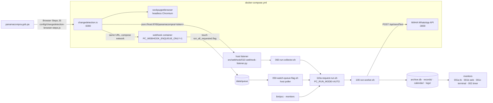
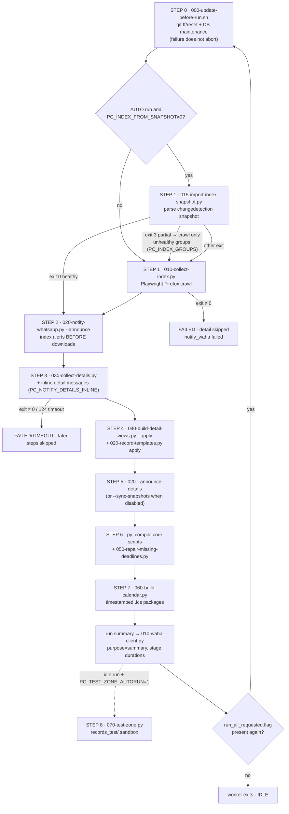
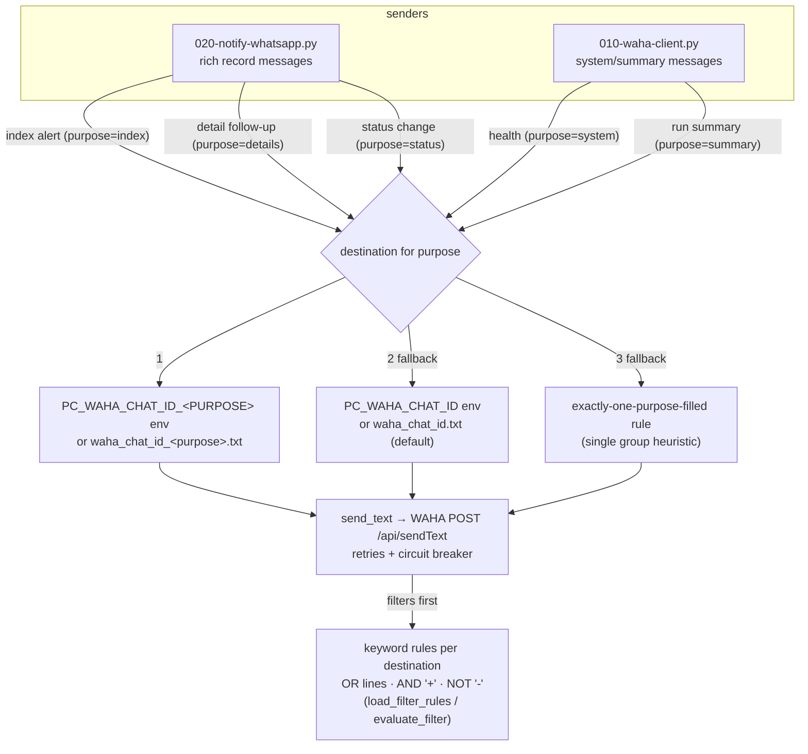
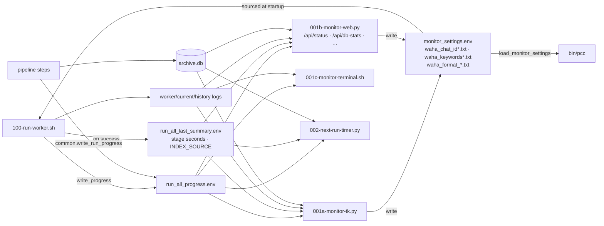
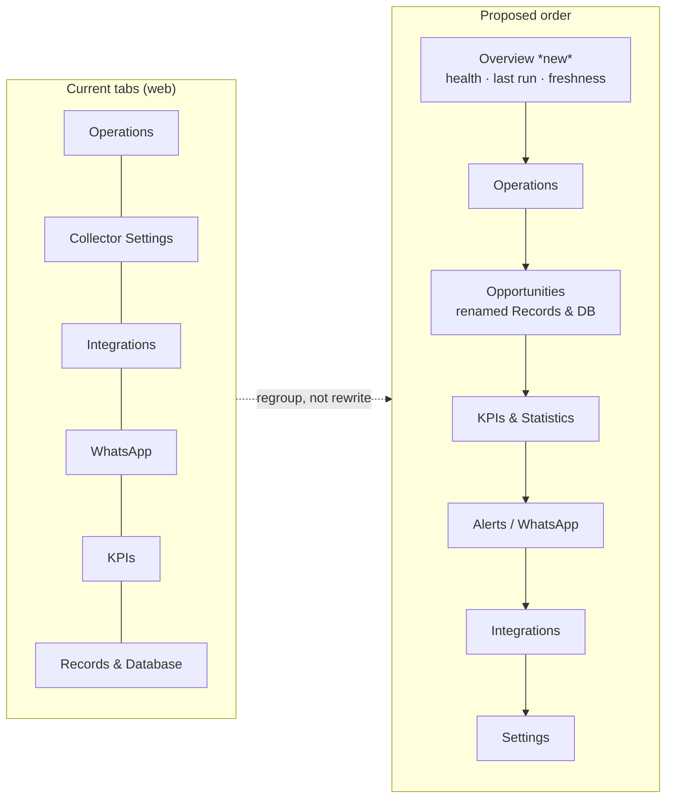
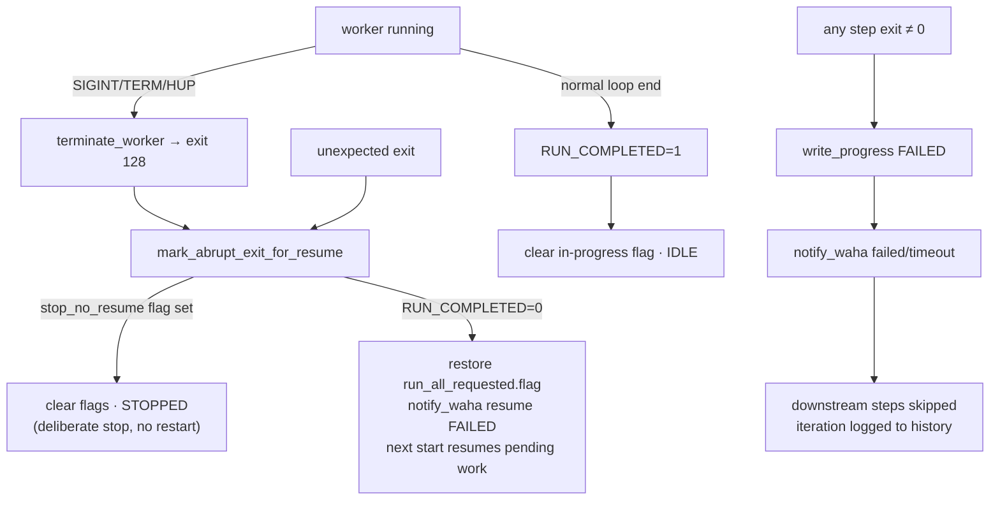
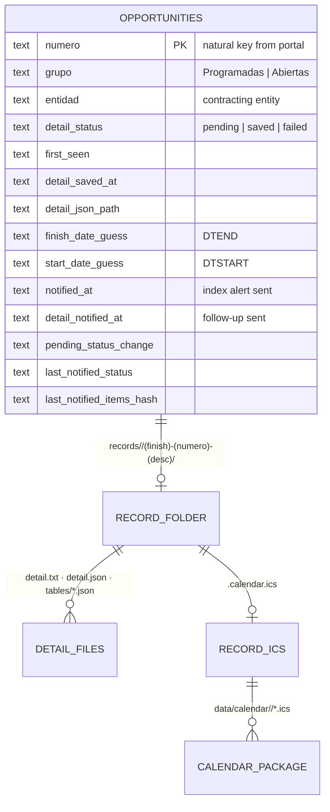

# Diagrams

Mermaid diagrams for the PanamaCompra Collector, verified against the code in
July 2026. Render on GitHub or any Mermaid-capable viewer. See
ARCHITECTURE.md for the prose version with file/line citations.

## 1. System architecture

## 2. Pipeline execution flow (one worker iteration)

## 3. Notification flow & purpose routing

## 4. Monitor information flow

## 5. Dashboard information architecture (current → proposed)

## 6. Error-handling / resume flow

## 7. Entity / status data model (storage view)

Schema columns verified against the additive migration map in
`src/common.py:1166-1183`; folder convention from
`common.build_record_folder_leaf`.
